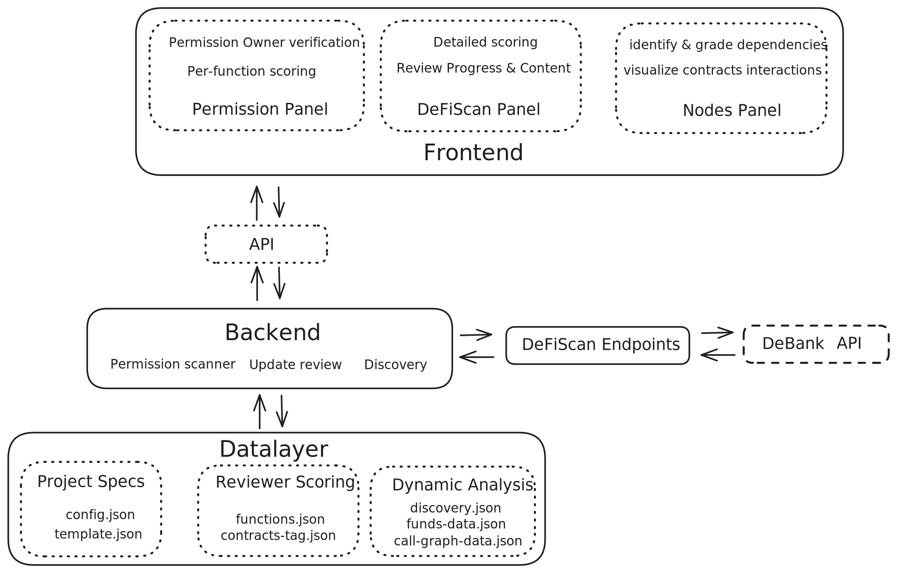

# Architecture

We build on top of the existing architecture to add capabilities dedicated to DeFi monitoring and the complete granularity of a DeFi protocol's inventory assets.

The tool is enhanced at multiple levels to add and automate the analysis for DeFi protocols, in addition to the complete discovery of the protocol handled natively by L2Beat (discovery.json). This includes detection and analysis of function-level permissions (functions.json), a complete call graph and detection of external calls (call-graph-data.json), as well as tracking of funds and positions in protocols (funds-data.json). In addition to those elements, reviewers can "tag" contracts to specify elements useful to the review (stored in contracts-tag.json), as well as correct or specify function characteristics (stored in functions.json).

## Frontend

The frontend is used to help researchers visualize the result of an analysis and complete the manual actions required during the review process. The frontend queries the backend through an API, a simple Express.js server defined in `packages/l2b/src/implementations/discovery-ui/main.ts`. Following the minimum integration principle we [defined](developers/contributing.md), all endpoints added for *DeFiScan V2* are `in packages/l2b/src/implementations/discovery-ui/defidisco/` and are simply imported and registered in the `main.ts`. The frontend makes those API calls from `packages/protocolbeat/src/api/api.ts`.

## Backend

The backend is primarily its API endpoints mentioned above. Through these endpoints it can also perform some of the analysis routines such as *discovery*, *fetching funds data*, *creating the call graph*, or *detecting permissions*. It also performs the manual changes made by reviewers/researchers such as *tagging contracts* or changing *function characteristics*.

### Discovery

The discovery process is mostly untouched from the initial [l2beat deployment](https://github.com/l2beat/l2beat), it uses the `config.json` as well as contract templates (`template.json`) to determine how to scan the contract and which data to report in the output (`discovery.json`), this data is then used extensively in the frontend and in other routines.

### Funds Data

Funds data in the backend relies on the [defiscan endpoint](). It calls this endpoint to fetch the data for the given addresses. Note that the service has to be running (separately). It stores the data locally in a `funds-data.json` file linked to the project.

### Callgraph

The callgraph is a tool that deterministically detects all possible external contract calls made by each function of a contract. It then attempts to maps those calls to known contracts in the discovery. This resolution to known contracts can only be done usually for 10-30% of cases because the contracts called might not be deterministic. Detecting those calls is made using Slither's slitherir feature, which we then parse in `/packages/l2b/src/implementations/discovery-ui/defidisco/callGraph.ts` and store in `call-graph-data.json`.

### Permissions

Currently all permissions are detected through AI queries. The queries include the cropped source code, along with a prompt asking to detect any permissioned functions. In the future this will be combined with our existing [permission-scanner](https://github.com/deficollective/permission-scanner). Currently, queries are made sequentially, they use the model and API key defined in the `.env`. The frontend allows the researcher/reviewer to select which contract they want to run the scanner for. 

In addition to detecting permissions, the AI resolves the permission owner wherever possible. Permission owners are stored as a path, the path refers to the data in `discovery.json`. The paths are defined as follows:

 - *$self* refers to the address of the current contract itself
 - *$self.fieldName* refers to a field of the contract containing the owner address (eg. $self.owner)
 - *$self.signers[0]* refers to the first entry of the array which contains the address of an owner, it could also be used to refer all owners using $self.signers
 - *$self.accessControl.ADMIN_ROLE.members* refers to all members of the role *ADMIN_ROLE* if the contract inherits OpenZeppelin's AccessControl's contract.
 - *@governor.fieldName* refers to a field in another contract. *governor* is the name of the field containing the contract address in the original contract. This syntax can be combined with any of the elements above to reach specific data of the target contract.

 This data is stored in `functions.json` for each project, it's grouped by contract. The data can be overriden manually by reviewers in the frontend.

### Contract Tags

Contract tags are specified by the reviewer/researcher and can only be changed manually. They improve the review by specifying which contract is external to the project, and whether or note we should fetch funds/positions data for the contracts. This is stored in `contracts-tag.json` for each project.
