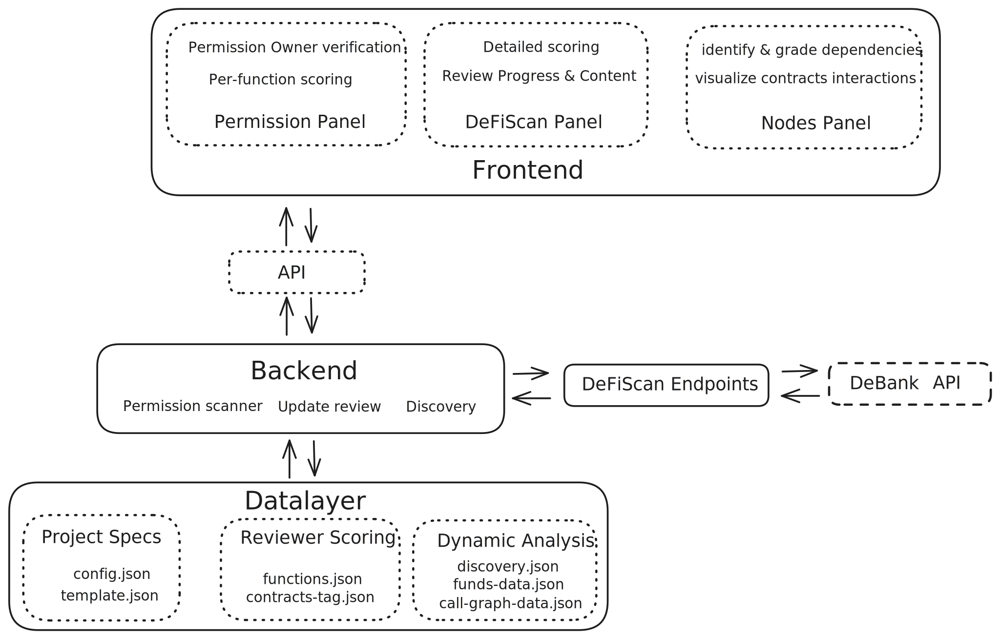

# Architecture

We build on top of the existing architecture to add capabilities dedicated to DeFi monitoring and the complete granularity of a DeFi protocol's inventory assets.

The tool is enhanced at multiple levels to add and automate the analysis for DeFi protocols, in addition to the complete discovery of the protocol handled natively by L2Beat (discovery.json). This includes detection and analysis of function-level permissions (functions.json), a complete call graph and detection of external calls (call-graph-data.json), as well as tracking of funds and positions in protocols (funds-data.json). In addition to those elements, reviewers can "tag" contracts to specify elements useful to the review (stored in contracts-tag.json), as well as correct or specify function characteristics (stored in functions.json).

## Frontend

The frontend is used to help researchers visualize the result of an analysis and complete the manual actions required during the review process. The frontend queries the backend through an API, a simple Express.js server defined in `packages/l2b/src/implementations/discovery-ui/main.ts`. Following the minimum integration principle we [defined](developers/contributing.md), all endpoints added for *DeFiScan V2* are `in packages/l2b/src/implementations/discovery-ui/defidisco/` and are simply imported and registered in the `main.ts`. The frontend makes those API calls from `packages/protocolbeat/src/api/api.ts`.

## Backend

The backend is primarily its API endpoints mentioned above. Through these endpoints it can also perform some of the analysis routines such as *discovery*, *fetching funds data*, *creating the call graph*, or *detecting permissions*. It also performs the manual changes made by reviewers/researchers such as *tagging contracts* or changing *function characteristics*.

### Discovery

The discovery process is mostly untouched from the initial [l2beat deployment](https://github.com/l2beat/l2beat), it uses the `config.json` as well as contract templates (`template.json`) to determine how to scan the contract and which data to report in the output (`discovery.json`), this data is then used extensively in the frontend and in other routines.

### Funds Data

Funds data in the backend relies on the [defiscan endpoint](). It calls this endpoint to fetch the data for the given addresses. Note that the service has to be running (separately). It stores the data locally in a `funds-data.json` file linked to the project.

We support fetching information regarding all balances and DeFi positions a contract might hold, as well as token price and market cap of token contracts.

### Callgraph

The callgraph is a tool that deterministically detects all possible external contract calls made by each function of a contract. It then attempts to maps those calls to known contracts in the discovery. This resolution to known contracts can only be done usually for 10-30% of cases because the contracts called might not be deterministic. Detecting those calls is made using Slither's slitherir feature, which we then parse in `/packages/l2b/src/implementations/discovery-ui/defidisco/callGraph.ts` and store in `call-graph-data.json`.

### Permissions

Currently all permissions are detected through AI queries. The queries include the cropped source code, along with a prompt asking to detect any permissioned functions. In the future this will be combined with our existing [permission-scanner](https://github.com/deficollective/permission-scanner). Currently, queries are made sequentially, they use the model and API key defined in the `.env`. The frontend allows the researcher/reviewer to select which contract they want to run the scanner for. 

In addition to detecting permissions, the AI resolves the permission owner wherever possible. Permission owners are stored as a path, the path refers to the data in `discovery.json`. The paths are defined as follows:

 - *$self* refers to the address of the current contract itself
 - *$self.fieldName* refers to a field of the contract containing the owner address (eg. $self.owner)
 - *$self.signers[0]* refers to the first entry of the array which contains the address of an owner, it could also be used to refer all owners using $self.signers
 - *$self.accessControl.ADMIN_ROLE.members* refers to all members of the role *ADMIN_ROLE* if the contract inherits OpenZeppelin's AccessControl's contract.
 - *@governor.fieldName* refers to a field in another contract. *governor* is the name of the field containing the contract address in the original contract. This syntax can be combined with any of the elements above to reach specific data of the target contract.

 This data is stored in `functions.json` for each project, it's grouped by contract. The data can be overriden manually by reviewers in the frontend.

### Contract Tags

Contract tags are specified by the reviewer/researcher and can only be changed manually. They improve the review by specifying which contract is external to the project, and whether or note we should fetch funds/positions data for the contracts. This is stored in `contracts-tag.json` for each project.

### Review Builder

The Review Builder stores all review configuration in a single `review-config.json` file per project. This includes protocol metadata (name, slug, chain, project type), entity descriptions for admins/dependencies/fund-holding contracts, and section content (e.g., Code & Audits).

**Backend**: `packages/l2b/src/implementations/discovery-ui/defidisco/reviewConfig.ts` handles CRUD operations. Three API endpoints are registered in `main.ts`:

- `GET /api/projects/:project/review-config` — returns the full config plus available templates
- `PUT /api/projects/:project/review-config` — saves the full config
- `PUT /api/projects/:project/review-config/entity` — partial update for a single admin/dependency/funds entry

**Frontend**: The `ReviewBuilderPanel.tsx` component provides the editor UI, with `ReviewDescriptionsEditor.tsx` for entity descriptions and `ReviewSectionEditor.tsx` for section tabs. Data source definitions in `reviewDataSources.ts` power the data table blocks.

**AI Generation**: The `/generate-review` Claude Code skill fetches pre-processed data from the l2b API, analyzes the protocol structure, and writes generated descriptions directly to `review-config.json`.

### Continuous Monitoring Service

The monitoring service is a standalone background process that continuously watches DeFi protocols for smart contract changes, refreshes live financial data, and compiles publishable review artifacts. It runs as a **GitHub Actions cron job** (daily at 8:00 CET), not as a long-running server.

**Entry point**: `packages/backend/src/defidisco-monitor.ts` — creates the config, application, and handles `RUN_ONCE` mode (used by GitHub Actions) vs long-running mode (Clock-based scheduling).

**Orchestrator**: `packages/backend/src/modules/defi-update-monitor/defidisco/DefidiscoMonitorApplication.ts` — wires all components and runs the monitoring loop. For each project listed in `packages/config/src/defidisco-config.json`:

1. **Discovery** — runs the L2Beat discovery engine (`DiscoveryRunner`)
2. **Diffing** — compares against the previous discovery snapshot stored in PostgreSQL
3. **Notification** — sends Discord messages when contract changes are detected
4. **Funds Refresh** — fetches live token balances and DeFi positions via DeBank API
5. **Review Compilation** — produces a self-contained `compiled-review.json` per project

After all projects are processed, a cycle summary is posted to Discord with project count, duration, and change count.

**Review Compilation**: `ReviewCompiler.ts` reads all project data files (discovery, permissions, call graph, funds, contract tags, review config), runs V2 scoring, resolves template variables in descriptions, and writes a single `compiled-review.json` that contains everything a frontend needs to render a protocol review page — no client-side data joining required. Compilation is gated on `review-config.json` and `call-graph-data.json` existing; if either is missing, the step is skipped (log only).

**Scheduling & Deployment**: The monitor runs via `.github/workflows/monitor.yml`:

1. Builds the Docker image (`Dockerfile.monitor`) with GHA layer caching
2. Runs Prisma migrations (separate step for clear error reporting)
3. Runs the monitor with `RUN_ONCE=true` — single cycle, then clean exit
4. Commits any updated `compiled-review.json` and `funds-data.json` files back to the repository

**Database**: PostgreSQL (Neon free tier) stores discovery cache (RPC response caching across ephemeral containers) and update monitor snapshots (for diffing against previous discoveries). The connection string is stored as a GitHub Actions secret.
