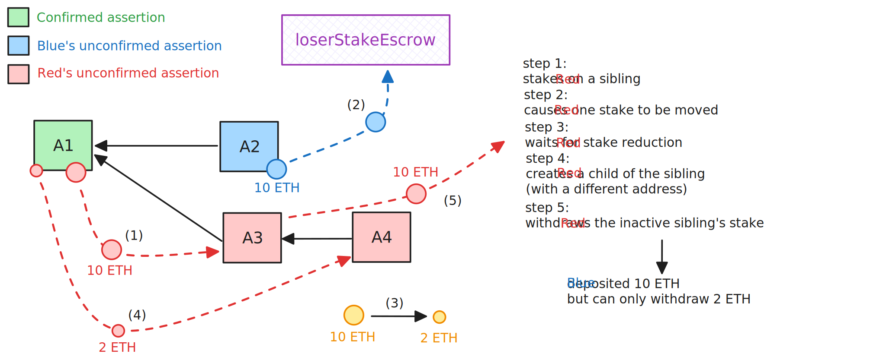

# Admin operations

<!-- START doctoc generated TOC please keep comment here to allow auto update -->
<!-- DON'T EDIT THIS SECTION, INSTEAD RE-RUN doctoc TO UPDATE -->
**Table of Contents**

- [The `RollupAdminLogic` contract](#the-rollupadminlogic-contract)
  - [`setChallengeManager` function](#setchallengemanager-function)
  - [`setValidatorWhitelistDisabled` function](#setvalidatorwhitelistdisabled-function)
  - [`setInbox` function](#setinbox-function)
  - [`setSequencerInbox` function](#setsequencerinbox-function)
  - [`setDelayedInbox` function](#setdelayedinbox-function)
  - [`setOutbox` function](#setoutbox-function)
  - [`removeOldOutbox` function](#removeoldoutbox-function)
  - [`setWasmModuleRoot` function](#setwasmmoduleroot-function)
  - [`setLoserStakeEscrow` function](#setloserstakeescrow-function)
  - [`forceConfirmAssertion` function](#forceconfirmassertion-function)
  - [`forceCreateAssertion` function](#forcecreateassertion-function)
  - [`forceRefundStaker` function](#forcerefundstaker-function)
  - [`setBaseStake` function](#setbasestake-function)
  - [`setConfirmPeriodBlocks` function](#setconfirmperiodblocks-function)
  - [`setValidatorAfkBlocks` function](#setvalidatorafkblocks-function)
  - [`setMinimumAssertionPeriod` function](#setminimumassertionperiod-function)
  - [`setOwner` function](#setowner-function)
  - [`setValidator` function](#setvalidator-function)
  - [`pause` and `resume` functions](#pause-and-resume-functions)
  - [`setAnyTrustFastConfirmer` function](#setanytrustfastconfirmer-function)

<!-- END doctoc generated TOC please keep comment here to allow auto update -->

## The `RollupAdminLogic` contract

Calls to the Rollup proxy are forwarded to this contract if the `msg.sender` is the designated proxy admin.

### `setChallengeManager` function

This function allows the proxy admin to update the challenge manager contract reference.

```solidity
function setChallengeManager(
    address _challengeManager
) external
```

The challenge manager contract is used to determine whether an assertion can be considered a winner or not when attempting to confirm it.

### `setValidatorWhitelistDisabled` function

This function allows the proxy admin to disable the validator whitelist.

```solidity
function setValidatorWhitelistDisabled(
    bool _validatorWhitelistDisabled
) external
```

If the whitelist is enabled, only whitelisted validators can join the staker set and therefore propose new assertions.

### `setInbox` function

This function allows the proxy admin to update the inbox contract reference.[^2]

```solidity
 function setInbox(
    IInboxBase newInbox
) external
```

[^2]: TODO: explain what it is and why it is referenced here.

### `setSequencerInbox` function

This function allows the proxy admin to update the sequencer inbox contract reference.

```solidity
function setSequencerInbox(
    address _sequencerInbox
) external override
```

The call is forwarded to the `bridge` contract, specifically by calling its `setSequencerInbox` function. The bridge will only accept messages to be enqueued in the main `sequencerInboxAccs` array if the call comes from the `sequencerInbox`. The `sequencerInboxAccs` is read when creating new assertions, in particular when assigning the `nextInboxPosition` to the new assertion and when checking that the currently considered assertion doesn't claim to have processed more messages than actually posted by the sequencer.

### `setDelayedInbox` function

This function allows the proxy admin to activate or deactivate a delayed inbox.

```solidity
function setDelayedInbox(address _inbox, bool _enabled) external override
```

The call is forwarded to the `bridge` contract, specifically by calling its `setDelayedInbox` function. The `bridge` contract will only accept messages to be enqueued in the delayed inbox if the call comes from an authorized inbox.

### `setOutbox` function

This function allows the proxy admin to update the outbox contract reference.

```solidity
function setOutbox(
    IOutbox _outbox
) external override
```

The outbox contract is used to send messages from L2 to L1. The call is forwarded to the `bridge` contract, specifically by calling its `setOutbox` function.

### `removeOldOutbox` function

This function allows the proxy admin to remove an old outbox contract reference.

```solidity
function removeOldOutbox(
    address _outbox
) external override
```

The call is forwarded to the `bridge` contract, specifically by calling its `setOutbox` function.

### `setWasmModuleRoot` function

This function allows the proxy admin to update the wasm module root, which represents the offchain program being verified by the proof system.

```solidity
function setWasmModuleRoot(
    bytes32 newWasmModuleRoot
) external override
```

The `wasmModuleRoot` is included in each assertion's `configData`.

### `setLoserStakeEscrow` function

This function allows the proxy admin to update the loser stake escrow contract reference.

```solidity
function setLoserStakeEscrow(
    address newLoserStakerEscrow
) external override
```

The loser stake escrow is used to store the excess stake when a conflicting assertion is created.

### `forceConfirmAssertion` function

This function allows the proxy admin to confirm an assertion without waiting for the challenge period, and without most validation of the assertions. 

```solidity
function forceConfirmAssertion(
    bytes32 assertionHash,
    bytes32 parentAssertionHash,
    AssertionState calldata confirmState,
    bytes32 inboxAcc
) external override whenPaused
```

The function can only be called when the contract is paused. It is only checked that the assertion is `Pending`.

### `forceCreateAssertion` function

This function allows the proxy admin to create a new assertion by skipping some of the validation checks.

```solidity
function forceCreateAssertion(
    bytes32 prevAssertionHash,
    AssertionInputs calldata assertion,
    bytes32 expectedAssertionHash
) external override whenPaused
```

The function can only be called when the contract is paused. It skips all checks related to staking, the check that the previous assertion exists and that the `minimumAssertionPeriod` has passed. Since the `configHash` of the previous assertion is fetched from the `_assertions` mapping, and the current assertion's `configData` in its `beforeStateData` is still checked against it, then this effectively acts as an existence check.

A comment in the function suggest a possible emergency procedure during which this function might be used:

```solidity
// To update the wasm module root in the case of a bug:
// 0. pause the contract
// 1. update the wasm module root in the contract
// 2. update the config hash of the assertion after which you wish to use the new wasm module root (functionality not written yet)
// 3. force refund the stake of the current leaf assertion(s)
// 4. create a new assertion using the assertion with the updated config has as a prev
// 5. force confirm it - this is necessary to set latestConfirmed on the correct line
// 6. unpause the contract
```

### `forceRefundStaker` function

This function allows the proxy admin to forcefully trigger refunds of stakers' deposit, bypassing the `msg.sender` checks.


```solidity
function forceRefundStaker(
    address[] calldata staker
)
```

The function still checks that each staker is inactive before triggering the refund.

### `setBaseStake` function

This function allows the proxy admin to update required stake to join the staker set and propose new assertions.

```solidity
function setBaseStake(
    uint256 newBaseStake
) external override
```

The function currently only allows to increase the base stake, not to decrease it, as an attacker might be able to steal honest funds from the contract.

<figure>
    
    <figcaption>An attack where it is possible to compromise honest parties' funds.</figcaption>
</figure>

### `setConfirmPeriodBlocks` function

This function allows the proxy admin to update the challenge period length.

```solidity
function setConfirmPeriodBlocks(
    uint64 newConfirmPeriod
) external override
```

the function just checks that the new value is greater than zero.

### `setValidatorAfkBlocks` function

This function allows the proxy admin to update the period after which the whitelist is removed if all validators are inactive.

```solidity
function setValidatorAfkBlocks(
    uint64 newAfkBlocks
) external override
```

### `setMinimumAssertionPeriod` function

This function allows the proxy admin to set the minimum time between two non-overflow assertions.

```solidity
function setMinimumAssertionPeriod(
    uint64 newPeriod
) external override
```

### `setOwner` function

This function allows the proxy admin to update the admin itself.

```solidity
function setOwner(
    address newOwner
) external override
```

it internally calls the `_changeAdmin` function.

### `setValidator` function

This function allows the proxy admin to add or remove validators from the whitelist.

```solidity
function setValidator(address[] calldata _validator, bool[] calldata _val) external override
```

### `pause` and `resume` functions

These functions allow the proxy admin to pause and resume the contract.

```solidity
function pause() external override
```

```solidity
function resume() external override
```

### `setAnyTrustFastConfirmer` function

This function allows the proxy admin to set a fast confirmer that can confirm assertions without waiting for the challenge period and propose new assertions without staking.

```solidity
function setAnyTrustFastConfirmer(
    address _anyTrustFastConfirmer
) external
```
