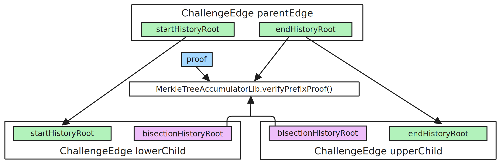

# The BoLD proof system

<!-- START doctoc generated TOC please keep comment here to allow auto update -->
<!-- DON'T EDIT THIS SECTION, INSTEAD RE-RUN doctoc TO UPDATE -->
**Table of Contents**

- [High-level overview](#high-level-overview)
- [The `RollupUserLogic` contract](#the-rollupuserlogic-contract)
  - [`stakeOnNewAssertion` function](#stakeonnewassertion-function)
  - [`newStakeOnNewAssertion` function](#newstakeonnewassertion-function)
  - [`newStake` function](#newstake-function)
  - [`confirmAssertion` function](#confirmassertion-function)
  - [`returnOldDeposit` and `returnOldDepositFor` functions](#returnolddeposit-and-returnolddepositfor-functions)
  - [`withdrawStakerFunds` function](#withdrawstakerfunds-function)
  - [`addToDeposit` function](#addtodeposit-function)
  - [`reduceDeposit` function](#reducedeposit-function)
  - [`removeWhitelistAfterValidatorAfk` function](#removewhitelistaftervalidatorafk-function)
  - [`removeWhitelistAfterFork` function](#removewhitelistafterfork-function)
- [Fast withdrawals](#fast-withdrawals)
  - [`fastConfirmAssertion` and `fastConfirmNewAssertion` functions](#fastconfirmassertion-and-fastconfirmnewassertion-functions)
- [The `EdgeChallengeManager` contract](#the-edgechallengemanager-contract)
  - [`createLayerZeroEdge` function](#createlayerzeroedge-function)
    - [Block-level layer zero edges](#block-level-layer-zero-edges)
    - [Non-block-level layer zero edges](#non-block-level-layer-zero-edges)
  - [`bisectEdge` function](#bisectedge-function)
  - [`confirmEdgeByOneStepProof` function](#confirmedgebyonestepproof-function)
  - [`confirmEdgeByTime` function](#confirmedgebytime-function)
  - [`updateTimerCacheByClaim` function](#updatetimercachebyclaim-function)
  - [`updateTimerCacheByChildren` function](#updatetimercachebychildren-function)
- [[WIP] The `OneStepProofEntry` contract](#wip-the-onestepproofentry-contract)
  - [`proveOneStep` function](#proveonestep-function)

<!-- END doctoc generated TOC please keep comment here to allow auto update -->

## High-level overview

Each pending assertion is backed by one single stake. A stake on an assertion also counts as a stake for all of its ancestors in the assertions tree. If an assertion has a child made by someone else, its stake can be moved anywhere else since there is already some stake backing it. Implicitly, the stake is tracked to be on the latest assertion a staker is staked on, and the outside logic makes sure that a new assertion can be created only in the proper conditions. In other words, it is made impossible for one actor to be staked on multiple assertions at the same time. If the last assertion of a staker has a child or is confirmed, then the staker is considered "inactive". If conflicting assertions are created, then one stake amount will be moved to a "loser stake escrow" as the protocol guarantees that only one stake will eventually remain active, and that the other will be slashed. The token used for staking is defined in the `stakeToken` onchain value.

<figure>
    
    <figcaption>An example of an assertion tree during an execution of the BoLD protocol.</figcaption>
</figure>


## The `RollupUserLogic` contract

Calls to the Rollup proxy are forwarded to this contract if the `msg.sender` is not the designated proxy admin.

### `stakeOnNewAssertion` function

<figure>
    
    <figcaption>Some of the used structures and performed checks before creating a new assertion.</figcaption>
</figure>

The entry point to propose new state roots, given that the staker is already staked on some other assertion on the same branch, is the `stakeOnNewAssertion` function in the `RollupProxy` contract, more specifically in the `RollupUserLogic` implementation contract. 

```solidity
function stakeOnNewAssertion(
    AssertionInputs calldata assertion,
    bytes32 expectedAssertionHash
) public onlyValidator(msg.sender) whenNotPaused
```

The function is gated by the `onlyValidator` modifier, which checks whether the validator whitelist is disabled, or if the caller is whitelisted. Usage of the whitelist is recommended for all chains without very high amounts of value secured. Realistically, only Arbitrum One will operate without a whitelist.

It is then checked that the caller is staked by querying the `_stakerMap` mapping, which maps from addresses to `Staker` struct, defined as:

```solidity
struct Staker {
    uint256 amountStaked;
    bytes32 latestStakedAssertion;
    uint64 index;
    bool isStaked;
    address withdrawalAddress;
}
```

in particular, the `isStaked` field is checked to be `true`.

The `AssertionInputs` struct is defined as:

```solidity
struct AssertionInputs {
    // Additional data used to validate the before state
    BeforeStateData beforeStateData;
    AssertionState beforeState;
    AssertionState afterState;
}
```

The `BeforeStateData` struct is defined as:

```solidity
struct BeforeStateData {
    // The assertion hash of the prev of the beforeState(prev)
    bytes32 prevPrevAssertionHash;
    // The sequencer inbox accumulator asserted by the beforeState(prev)
    bytes32 sequencerBatchAcc;
    // below are the components of config hash
    ConfigData configData;
}
```

The `ConfigData` struct is defined as:

```solidity
struct ConfigData {
    bytes32 wasmModuleRoot;
    uint256 requiredStake;
    address challengeManager;
    uint64 confirmPeriodBlocks;
    uint64 nextInboxPosition;
}
```

It is then verified that the `amountStaked` is at least the required amount. This is checked against the user-supplied `requiredStake` in the `configData` of the `beforeStateData`. The correspondence of the user provided data will be later checked against the one already stored onchain.

The `AssertionState` struct is defined as:

```solidity
struct AssertionState {
    GlobalState globalState;
    MachineStatus machineStatus;
    bytes32 endHistoryRoot;
}
```

An assertion hash (as in the `expectedAssertionHash` param) is calculated by calling the `assertionHash` function of the `RollupLib` library, which takes as input the previous assertion hash, the current state hash and the current sequencer inbox accumulator. In the case of the `beforeStateData`, the previous assertion hash is the `prevPrevAssertionHash`, the current state hash is the `beforeState` hash and the current sequencer inbox accumulator is the `sequencerBatchAcc` of the `beforeStateData`. On a high level, this corresponds to hashing the previous state with the current state and the inputs leading from the previous to the current state.

The `_assertions` mapping maps from assertion hashes to `AssertionNode` struct, which are defined as:

```solidity
struct AssertionNode {
    // This value starts at zero and is set to a value when the first child is created. After that it is constant until the assertion is destroyed or the owner destroys pending assertions
    uint64 firstChildBlock;
    // This value starts at zero and is set to a value when the second child is created. After that it is constant until the assertion is destroyed or the owner destroys pending assertions
    uint64 secondChildBlock;
    // The block number when this assertion was created
    uint64 createdAtBlock;
    // True if this assertion is the first child of its prev
    bool isFirstChild;
    // Status of the Assertion
    AssertionStatus status;
    // A hash of the context available at the time of this assertions creation. It should contain information that is not specific
    // to this assertion, but instead to the environment at the time of creation. This is necessary to store on the assertion
    // as this environment can change and we need to know what it was like at the time this assertion was created. An example
    // of this is the wasm module root which determines the state transition function on the L2. If the wasm module root
    // changes we need to know that previous assertions were made under a different root, so that we can understand that they
    // were valid at the time. So when resolving a challenge by one step, the edge challenge manager finds the wasm module root
    // that was recorded on the prev of the assertions being disputed and uses it to resolve the one step proof.
    bytes32 configHash;
}
```

The function will check that such previous assertion hash already exists in the `_assertions` mapping by verifying that the `status` is different than `NoAssertion`. The possible statuses are `NoAssertion`, `Pending` or `Confirmed`.

To effectively move their stake, the function then checks that the `msg.sender`'s last assertion their staked on is the previous assertion hash claimed during this call, or that the last assertion their staked on has at least one child by checking the `firstChildBlock` field, meaning that someone else has decided to back the claim with another assertion.

Before creating the new assertion, it is made sure that the config data of the claimed previous state matches the one that is already stored in the `_assertions` mapping. This is necessary because the assertion hashes do not contain the config data and the previous check does not cover this case. It is then checked that the final machine status is either `FINISHED` or `ERRORED` as a sanity check [^2]. The possible machine statuses are `RUNNING`, `FINISHED` or `ERRORED`. An `ERRORED` state is considered valid because it proves that something went wrong during execution and governance has to intervene to resolve the issue.

Then, the correspondence between the values in `assertion` and the previous assertion hash is again checked, but this check was confirmed to be redundant as the previous assertion hash is already calculated from the `assertion` values.

The `beforeState`'s `machineStatus` must be `FINISHED` as it is not possible to advance from an `ERRORED` state.

The `GlobalState` struct is defined as:

```solidity
struct GlobalState {
    bytes32[2] bytes32Vals;
    uint64[2] u64Vals;
}
```

where `u64Vals[0]` represents a inbox position, `u64Vals[1]` represents a position in message, `bytes32Vals[0]` represents a block hash, and `bytes32Vals[1]` represents a send root. It is checked that the position of the `afterState` is greater than the position of the `beforeState`, where the position is first checked against the inbox position, and, if equal, against the message position, to verify that the claim processes at least some new messages. It is then verified that the `beforeStateData`'s `nextInboxPosition` is greater or equal than the `afterState`'s inbox position. The `nextInboxPosition` can be seen as a "target" for the next assertion to process messages up to. If the current assertion didn't manage to process all messages up to the target, it is considered a "overflow" assertion. It is also checked that the current assertion doesn't claim to process more messages than currently posted by the sequencer.

The `nextInboxPosition` is prepared for the next assertion to be either the current sequencer message count (as per `bridge.sequencerMessageCount()`), or, if the current assertion already processed all messages, to the current sequencer message count plus one. In this way, all assertions are forced to process at least one message, and in this case, the next assertion will process exactly one message before updating the `nextInboxPosition` again. The `afterInboxPosition` is then checked to be non-zero. The `newAssertionHash` is calculated given the `previousAssertionHash` already checked, the `afterState` and the `sequencerBatchAcc` calculated given the `afterState`'s inbox position in its `globalState`. It is check that this calculated hash is equal to the `expectedAssertionHash`, and that it doesn't already exist in the `_assertions` mapping.

The new assertion is then created using the `AssertionNodeLib.createAssertion` function, which properly constructs the `AssertionNode` struct. The `isFirstChild` field is set to `true` only if the `prevAssertion`'s `firstChildBlock` is zero, meaning that there is none. The assertion status will be `Pending`, the `createdAtBlock` at the current block number, and the `configHash` will contain the current onchain wasm module root, the current onchain base stake, the current onchain challenge period length (`confirmPeriodBlocks`), the current onchain challenge manager contract reference and the `nextInboxPosition` as previously calculated. It is then saved in the previous assertion that a child has been created, and that the `_assertions` mapping is updated with the new assertion hash. 

The `_stakerMap` is then updated to store the new latest assertion. If the assertion is not an overflow assertion, i.e. it didn't process all messages up to the target set by the previous assertion, a `minimumAssertionPeriod` gets enforced, meaning that validators cannot arbitrarily post assertions at any time of any size.

If the assertion is not a first child, then the stake already present in this contract is transferred to the `loserStakeEscrow` contract, as only one stake is needed to be ready to be refunded from this contract.

### `newStakeOnNewAssertion` function

This function is used to create a new assertion and stake on it if the staker is not already staked on any assertion on the same branch. 

```solidity
function newStakeOnNewAssertion(
    uint256 tokenAmount,
    AssertionInputs calldata assertion,
    bytes32 expectedAssertionHash,
    address _withdrawalAddress
) public
```

It first checks that the validator is in the whitelist or that the whitelist is disabled, and that it is not already staked. Both the `stakerList` and the `stakerMap` mappings are updated with the new staker information. In particular, the latest confirmed assertion is used as the latest staked assertion. Any pending assertion trivially sits on the same branch as this one. After this, the function flow follows the same as the `stakeOnNewAssertion` function. Finally, the tokens are transferred from the staker to the contract.

An alternative function signature can be found, where the `msg.sender` is passed as the withdrawal address:

```solidity
function newStakeOnNewAssertion(
    uint256 tokenAmount,
    AssertionInputs calldata assertion,
    bytes32 expectedAssertionHash
) external
```

### `newStake` function

This function is used to join the staker set without adding a new assertion.

```solidity
function newStake(
    uint256 tokenAmount,
    address _withdrawalAddress
) external whenNotPaused
```

as above, under the hood, the latest confirmed assertion is used as the latest staked assertion for this staker. The funds are then transferred from the staker to the contract.

### `confirmAssertion` function

The function is used to confirm an assertion and make it available for withdrawals and in general L2 to L1 messages to be executed on L1.

```solidity
function confirmAssertion(
    bytes32 assertionHash,
    bytes32 prevAssertionHash,
    AssertionState calldata confirmState,
    bytes32 winningEdgeId,
    ConfigData calldata prevConfig,
    bytes32 inboxAcc
) external onlyValidator(msg.sender) whenNotPaused
```

It is first checked that the challenge period has passed by comparing the current block time, the `createdAtBlock` value of the assertion to be confirmed and the `confirmPeriodBlocks` of the config of the previous assertion. The previous assertion must be the latest confirmed assertion, meaning that assertions must be confirmed in order. It is checked whether the previous assertion has only one child or not. If not, it means that a challenge took place, so it is verified that the assertion to be confirmed is the winner. To assert this, a `winningEdgeId` is provided to fetch an edge from the `challengeManager` contract, specified again in the config of the previous assertion.

The `ChallengeEdge` struct is defined as:

```solidity
struct ChallengeEdge {
    /// @notice The origin id is a link from the edge to an edge or assertion at a lower level.
    ///         Intuitively all edges with the same origin id agree on the information committed to in the origin id
    ///         For a SmallStep edge the origin id is the 'mutual' id of the length one BigStep edge being claimed by the zero layer ancestors of this edge
    ///         For a BigStep edge the origin id is the 'mutual' id of the length one Block edge being claimed by the zero layer ancestors of this edge
    ///         For a Block edge the origin id is the assertion hash of the assertion that is the root of the challenge - all edges in this challenge agree
    ///         that that assertion hash is valid.
    ///         The purpose of the origin id is to ensure that only edges that agree on a common start position
    ///         are being compared against one another.
    bytes32 originId;
    /// @notice A root of all the states in the history up to the startHeight
    bytes32 startHistoryRoot;
    /// @notice The height of the start history root
    uint256 startHeight;
    /// @notice A root of all the states in the history up to the endHeight. Since endHeight > startHeight, the startHistoryRoot must
    ///         commit to a prefix of the states committed to by the endHistoryRoot
    bytes32 endHistoryRoot;
    /// @notice The height of the end history root
    uint256 endHeight;
    /// @notice Edges can be bisected into two children. If this edge has been bisected the id of the
    ///         lower child is populated here, until that time this value is 0. The lower child has startHistoryRoot and startHeight
    ///         equal to this edge, but endHistoryRoot and endHeight equal to some prefix of the endHistoryRoot of this edge
    bytes32 lowerChildId;
    /// @notice Edges can be bisected into two children. If this edge has been bisected the id of the
    ///         upper child is populated here, until that time this value is 0. The upper child has startHistoryRoot and startHeight
    ///         equal to some prefix of the endHistoryRoot of this edge, and endHistoryRoot and endHeight equal to this edge
    bytes32 upperChildId;
    /// @notice The edge or assertion in the upper level that this edge claims to be true.
    ///         Only populated on zero layer edges
    bytes32 claimId;
    /// @notice The entity that supplied a mini-stake accompanying this edge
    ///         Only populated on zero layer edges
    address staker;
    /// @notice The block number when this edge was created
    uint64 createdAtBlock;
    /// @notice The block number at which this edge was confirmed
    ///         Zero if not confirmed
    uint64 confirmedAtBlock;
    /// @notice Current status of this edge. All edges are created Pending, and may be updated to Confirmed
    ///         Once Confirmed they cannot transition back to Pending
    EdgeStatus status;
    /// @notice The level of this edge.
    ///         Level 0 is type Block
    ///         Last level (defined by NUM_BIGSTEP_LEVEL + 1) is type SmallStep
    ///         All levels in between are of type BigStep
    uint8 level;
    /// @notice Set to true when the staker has been refunded. Can only be set to true if the status is Confirmed
    ///         and the staker is non zero.
    bool refunded;
    /// @notice TODO
    uint64 totalTimeUnrivaledCache;
}
```

where `EdgeStatus` can either be `Pending` or `Confirmed`.

In particular, the `claimId` is checked to be the assertion hash to be confirmed, the `status` has to be `Confirmed` and the `confirmedAtBlock` value should not be zero. On top of the challenge period, it is required that the `confirmedAtBlock` value is at least `challengeGracePeriodBlocks` old, with the purpose of being able to recover in case an invalid assertion is confirmed because of a bug.

The current assertion is checked to be `Pending`, as opposed to `NoAssertion` or `Confirmed`. An external call to the Outbox is made by passing the `sendRoot` and `blockHash` saved in the current assertion's `globalState`. Finally, the `_latestConfirmed` assertion is updated with the current one and the status is updated to `Confirmed`.


### `returnOldDeposit` and `returnOldDepositFor` functions

This function is used to initiate a refund of the staker's deposit when its latest assertion either has a child or is confirmed.

```solidity
function returnOldDeposit() external override onlyValidator(msg.sender) whenNotPaused
```

```solidity
function returnOldDepositFor(
    address stakerAddress
) external override onlyValidator(stakerAddress) whenNotPaused
```

In the first case, it is checked than the `msg.sender` is the validator itself, while in the second case that the sender is the designated withdrawal address for the staker. Then it is verified that the staker is actively staked, and that it is "inactive". A staker is defined as inactive when their latest assertion is either confirmed or has at least one child, meaning that there is some other stake backing it.

At this point the `_withdrawableFunds` mapping value is increased by the staker's deposit for its withdrawal address, as well as the `totalWithdrawableFunds` value. The staker is then deleted from the `_stakerList` and `_stakerMap` mappings. The funds are not actually transferred at this point.

### `withdrawStakerFunds` function

This function is used to finalize the withdrawal of uncommitted funds from this contract to the `msg.sender`.

```solidity
function withdrawStakerFunds() external override whenNotPaused returns (uint256)
```

This is done by checking the `_withdrawableFunds` mapping, which maps from addresses to `uint256` amounts. The mapping is then set to zero, and the `totalWithdrawableFunds` value is updated accordingly. Finally, the funds are transferred to the `msg.sender`.

### `addToDeposit` function

This function is used to add funds to the staker's deposit.

```solidity
function addToDeposit(
    address stakerAddress,
    address expectedWithdrawalAddress,
    uint256 tokenAmount
) external whenNotPaused
```

The staker is supposed to be already staked when calling this function. In particular, the `amountStaked` is increased by the amount sent.

### `reduceDeposit` function

This function is used to reduce the staker's deposit.

```solidity
function reduceDeposit(
    uint256 target
) external onlyValidator(msg.sender) whenNotPaused
```

The staker is required to be inactive. The difference between the current deposit and the `target` is then added to the amount of withdrawable funds. 

### `removeWhitelistAfterValidatorAfk` function

If a whitelist is enabled, the system allows for its removal if all validators are inactive for a certain amount of time. The function checks whether the latest confirmed assertion, or its first child if present, is older than `validatorAfkBlocks`. If the `validatorAfkBlocks` onchain value is set to 0, this mechanism is disabled.

```solidity
function removeWhitelistAfterValidatorAfk() external
```
If the `validatorAfkBlocks` is set to be greater than the challenge period (or more precisely, two times the challenge period in the worst case), then the child will be confirmed (if valid) before being used for the calculation. The first child check is likely used in case the `validatorAfkBlocks` is set to be smaller than the challenge period.

It's important to note that this function is quite different from its pre-BoLD version.

There is an edge case in case the `minimumAssertionPeriod` is set lower than the difference between the challenge period and the `validatorAfkBlocks`, where the whitelist gets removed no matter what.

<figure>
    
    <figcaption>Since the `validatorAfkBlocks` value is set to be lower than the challenge period, the whitelist might get unexpectedly dropped.</figcaption>
</figure>

Under standard deployments, the `validatorAfkBlocks` value is set to be around twice the maximum delay caused by the challenge protocol, which is two times the challenge period.

### `removeWhitelistAfterFork` function

This function is used to remove the whitelist in case the chain id of the underlying chain changes.

```solidity
function removeWhitelistAfterFork() external
```

It simply checks that the `deploymentTimeChainId`, which is stored onchain, matches the `block.chainId` value.

## Fast withdrawals

Fast withdrawals is a feature introduced in nitro-contracts v2.1.0 for AnyTrust chains. It allows to specify a `anyTrustFastConfirmer` address that can propose and confirm assertions without waiting for the challenge period to pass.

### `fastConfirmAssertion` and `fastConfirmNewAssertion` functions

To immediately confirm an already proposed assertion, the `fastConfirmAssertion` function is used in the `RollupUserLogic` contract:

```solidity
function fastConfirmAssertion(
    bytes32 assertionHash,
    bytes32 parentAssertionHash,
    AssertionState calldata confirmState,
    bytes32 inboxAcc
) public whenNotPaused
```

the function checks that the `msg.sender` is the `anyTrustFastConfirmer` address, and that the assertion is pending. The assertion is then confirmed as in the `confirmAssertion` function.

The `anyTrustFastConfirmer` is also allowed to propose new assertions without staker checks, and also immediately confirm such assertions. To do so, the `fastConfirmNewAssertion` function is used:

```solidity
function fastConfirmNewAssertion(
    AssertionInputs calldata assertion,
    bytes32 expectedAssertionHash
) external whenNotPaused
```

Both functions, in practice, act very similar to the admin-gated `forceCreateAssertion` and `forceConfirmAsserton` functions in the `RollupAdminLogic` contract, see [Admin operations](./admin_ops.md) for more details.

## The `EdgeChallengeManager` contract

This contract implements the challenge protocol for the BoLD proof system.

### `createLayerZeroEdge` function

<figure>
    
    <figcaption>Some structs and checks performed when creating a layer zero edge of type Block.</figcaption>
</figure>

This function is used to initiate a challenge between sibling assertions. All "layer zero" edges have a starting "height" of zero and a starting "length" of one.
 
```solidity
function createLayerZeroEdge(
    CreateEdgeArgs calldata args
) external returns (bytes32)
```

The `CreateEdgeArgs` struct is defined as:

```solidity
struct CreateEdgeArgs {
    /// @notice The level of edge to be created. Challenges are decomposed into multiple levels.
    ///         The first (level 0) being of type Block, followed by n (set by NUM_BIGSTEP_LEVEL) levels of type BigStep, and finally
    ///         followed by a single level of type SmallStep. Each level is bisected until an edge
    ///         of length one is reached before proceeding to the next level. The first edge in each level (the layer zero edge)
    ///         makes a claim about an assertion or assertion in the lower level.
    ///         Finally in the last level, a SmallStep edge is added that claims a lower level length one BigStep edge, and these
    ///         SmallStep edges are bisected until they reach length one. A length one small step edge
    ///         can then be directly executed using a one-step proof.
    uint8 level;
    /// @notice The end history root of the edge to be created
    bytes32 endHistoryRoot;
    /// @notice The end height of the edge to be created.
    /// @dev    End height is deterministic for different levels but supplying it here gives the
    ///         caller a bit of extra security that they are supplying data for the correct level of edge
    uint256 endHeight;
    /// @notice The edge, or assertion, that is being claimed correct by the newly created edge.
    bytes32 claimId;
    /// @notice Proof that the start history root commits to a prefix of the states that
    ///         end history root commits to
    bytes prefixProof;
    /// @notice Edge type specific data
    ///         For Block type edges this is the abi encoding of:
    ///         bytes32[]: Inclusion proof - proof to show that the end state is the last state in the end history root
    ///         AssertionStateData: the before state of the edge
    ///         AssertionStateData: the after state of the edge
    ///         bytes32 predecessorId: id of the prev assertion
    ///         bytes32 inboxAcc:  the inbox accumulator of the assertion
    ///         For BigStep and SmallStep edges this is the abi encoding of:
    ///         bytes32: Start state - first state the edge commits to
    ///         bytes32: End state - last state the edge commits to
    ///         bytes32[]: Claim start inclusion proof - proof to show the start state is the first state in the claim edge
    ///         bytes32[]: Claim end inclusion proof - proof to show the end state is the last state in the claim edge
    ///         bytes32[]: Inclusion proof - proof to show that the end state is the last state in the end history root
    bytes proof;
}
```

In practice, the number of levels is usually set to be 3, with `NUM_BIGSTEP_LEVEL` set to 1. The `claimId` corresponds to an assertion hash.

If a whitelist is enabled in the system being validated, then the `msg.sender` must be whitelisted. The whitelist is referenced through the `assertionChain` onchain value. The type of the edge is fetched based on the level: if `0` then the type is `Block`, if `1` then the type is `BigStep`, if `2` then the type is `SmallStep`. This section will first discuss layer zero edges of type `Block`.

#### Block-level layer zero edges

If the edge is of type `Block`, then the `proof` field is decoded to fetch two `AssertionStateData` structs, one for the `predecessorStateData` and the other for the `claimStateData`.

The `AssertionStateData` struct is defined as:

```solidity
struct AssertionStateData {
    /// @notice An execution state
    AssertionState assertionState;
    /// @notice assertion Hash of the prev assertion
    bytes32 prevAssertionHash;
    /// @notice Inbox accumulator of the assertion
    bytes32 inboxAcc;
}
```

It is checked that the `claimStateData` produces the same hash as the `claimId`, and that the `predecessorStateData` produces the same hash as the `claimStateData`'s `prevAssertionHash`. It is then checked the provided `endHistoryRoot` matches the one in the `claimStateData`'s `assertionState`.

The `claimStateData`'s `previousAssertionHash` should be seen as a link to the information rivals agree on, which corresponds to the `predecessorStateData`.

An `AssertionReferenceData` struct is created, which is defined as:

```solidity
struct AssertionReferenceData {
    /// @notice The id of the assertion - will be used in a sanity check
    bytes32 assertionHash;
    /// @notice The predecessor of the assertion
    bytes32 predecessorId;
    /// @notice Is the assertion pending
    bool isPending;
    /// @notice Does the assertion have a sibling
    bool hasSibling;
    /// @notice The execution state of the predecessor assertion
    AssertionState startState;
    /// @notice The execution state of the assertion being claimed
    AssertionState endState;
}
```

which is instantiated in the following way:

```solidity
ard = AssertionReferenceData(
    args.claimId,
    claimStateData.prevAssertionHash,
    assertionChain.isPending(args.claimId),
    assertionChain.getSecondChildCreationBlock(claimStateData.prevAssertionHash) > 0,
    predecessorStateData.assertionState,
    claimStateData.assertionState
)
```

The assertion must be `Pending` for its edge to be created and it has to have a rival, i.e. a sibling. It is checked that both the `machineStatus` of the `startState` and `endState` is not `RUNNING`.

The `proof` is then decoded to fetch an `inclusionProof`. Hashes of both the `startState` and `endState` are computed. The `startHistoryRoot` is computed just by appending the `startState` hash to an empty merkle tree, as it is the initial state of a layer zero node. It is checked that the `endState` hash is included in the `endHistoryRoot` using the `inclusionProof`. The position of such hash is saved in the `LAYERZERO_BLOCKEDGE_HEIGHT` constant. Then it is checked that the previously computed `startHistoryRoot` is a prefix of `endHistoryRoot` by using the `prefixProof`.

Finally, a `ChallengeEdge` is created using the `endState`'s `prevAssertionHash` as the `originId`, the `startHistoryRoot` computed before, a `startHeight` of zero, the `endHistoryRoot` provided, the proper `endHeight`, the `claimId`, the `msg.sender` as the staker, the appropriate level, the `status` is set to `Pending`, the `createdAtBlock` is set to the current block number, and the `confirmedAtBlock`, `lowerChildId`, `upperChildId` fields are initialized to zero and the `refunded` field is set to `false`.

If the whitelist is enabled, then it is checked that a single party cannot create two layer zero edges that rival each other. If the whitelist is disabled with check is not effective as an attacker can simply use a different address.

The edge is then added to the onchain `EdgeStore store` after it is checked that it doesn't exist already. The `mutualId` is calculated, which identifies all rival edges. If there is no rival, the edge is saved as `UNRIVALED` (representing a dummy edge id) in the `firstRivals` mapping, otherwise the current edge is saved into it.

Finally, a stake is requested to be sent to this address if there are no rivals, or to the `excessStakeReceiver` otherwise, which corresponds to the `loserStakeEscrow` contract. It is important to note that for the `Block` level, the stake is set to zero, while for the other levels it is set to be some fractions of the bond needed to propose an assertion.

#### Non-block-level layer zero edges

If the edge is not of type `Block`, it means that an assertion on a lower level is being proposed, and it must link to an assertion of lower level (with `Block` being the lowest one). It is possible to create a non-`Block` level layer zero edge only if the lower level edge is of length one and is rivaled. It is checked that such edge is also `Pending` and that the level is just one lower the one being proposed.

The proof is then decoded in the following manner:

```solidity
(
    bytes32 startState,
    bytes32 endState,
    bytes32[] memory claimStartInclusionProof,
    bytes32[] memory claimEndInclusionProof,
    bytes32[] memory edgeInclusionProof
) = abi.decode(args.proof, (bytes32, bytes32, bytes32[], bytes32[], bytes32[]));
```

It is verified that the `startState` is part of the `startHistoryRoot` of the lower level edge and that the `endState` is part of the `endHistoryRoot` of the lower level edge, so that the current edge can be considered a more fine grained version of the lower level edge. It's important to note that it is still possible to propose an invalid higher-level edge for a valid lower-level edge, so it must be possible to propose multiple higher-level edges for the same lower-level edge.

The rest of the checks follow the same as the `Block` level edges, starting from the creation of the `startHistoryRoot` as a length one merkle tree, followed by the check that the `endState` is included in the `endHistoryRoot` using the `edgeInclusionProof`, and so on.

### `bisectEdge` function

This function is used to bisect edges into two children to break down the dispute process into smaller steps. No new stake as any new edge is checked against the history root of the parent edge.

```solidity
function bisectEdge(
    bytes32 edgeId,
    bytes32 bisectionHistoryRoot,
    bytes calldata prefixProof
) external returns (bytes32, bytes32)
```

It is checked that the edge being bisected is still `Pending` and that it is rivaled. It is then verified that the `bisectionHistoryRoot` is a prefix of the `endHistoryRoot` of the edge being bisected. 

<figure>
    
    <figcaption>The connection between a parent edge history root and child ones.</figcaption>
</figure>

Then both the lower and upper children are created, using the `startHistoryRoot` and `bisectionHistoryRoot` for the lower child, and `bisectionHistoryRoot` and `endHistoryRoot` root for the upper child. The children are then saved for the parent edge under the `lowerChildId` and `upperChildId` fields.

### `confirmEdgeByOneStepProof` function

This function is used to confirm an edge of length one with a one-step proof.

```solidity
 function confirmEdgeByOneStepProof(
    bytes32 edgeId,
    OneStepData calldata oneStepData,
    ConfigData calldata prevConfig,
    bytes32[] calldata beforeHistoryInclusionProof,
    bytes32[] calldata afterHistoryInclusionProof
) public
```

the function builds an `ExecutionContext` struct, which is defined as:

```solidity
struct ExecutionContext {
    uint256 maxInboxMessagesRead;
    IBridge bridge;
    bytes32 initialWasmModuleRoot;
}
```

where the `maxInboxMessagesRead` is filled with the `nextInboxPosition` of the config of the previous assertion, the `bridge` reference is taken from `assertionChain`, and the `initialWasmModuleRoot` is again taken from the config of the previous assertion. It is checked that the edge exists, that its type is `SmallStep`, and that its length is one.

Then the appropriate data to pass to the `oneStepProofEntry` contract for the onchain one step execution is prepared. In particular, the machine step correspondingto the start height of this edge is computed. Machine steps reset to zero with new blocks, so there's no need to fetch the corresponding `Block` level edge. The machine step of a `SmallStep` edge corresponds to its `startHeight` plus the `startHeight` of its `BigStep` edge. Previous level edges are fetched through the `originId` field stored in each edge and the `firstRivals` mapping. It is necessary to go through the `firstRivals` mapping as the `originId` stores a mutual id of the edge and not an edge id, which is needed to fetch the `startHeight`.

It is made sure that the `beforeHash` inside `oneStepData` is included in the `startHistoryRoot` at position `machineStep`. The `OneStepData` struct is defined as:

```solidity
struct OneStepData {
    /// @notice The hash of the state that's being executed from
    bytes32 beforeHash;
    /// @notice Proof data to accompany the execution context
    bytes proof;
}
```

The `oneStepProofEntry.proveOneStep` function is then called passing the execution context, the machine step, the `beforeHash` and the `proof` to calculate the `afterHash`. It is then checked that the `afterHash`is included in the `endHistoryRoot` at position `machineStep + 1`.

Finally, the edge status is updated to `Confirmed`, and the `confirmedAtBlock` is set to the current block number. Moreover, it is checked that no other rival is already confirmed through the `confirmedRivals` mapping inside the `store`, and if not the edge is saved there under its mutual id.

### `confirmEdgeByTime` function

This function is used to confirm an edge when enough time has passed, i.e. one challenge period on the player's clock.

```solidity
function confirmEdgeByTime(bytes32 edgeId, AssertionStateData calldata claimStateData) public
```

Only layer zero edges can be confirmed by time.

If the edge is block-level and the claim is the first child of its predecessor, then the time between its assertion and the second child's assertion is counted towards this edge. If this was not done, then the timer wouldn't count the time from when the assertion is created but it would need to wait it to be challenged, which is absurd. 

If the edge is unrivaled, then the time between the current block number and its creation is counted. If the edge is rivaled, and it was created before the rival, then the time between the rival's creation and this edge's creation is counted. If the edge is rivaled and it was created after the rival, then no time is counted.

If the edge has been bisected, i.e. it has children, then the minimum children unrivaled time is counted. The rationale is that if a child is correct but the parent is not, it would be incorrect to count the unrivaled time of the correct child towards the parent. If the honest party acts as fast as possible, then an incorrect claim's unrivaled time would always be close to zero. If an edge is confirmed by a one step proof, then it's unrivaled time is set to infinity (in practice `type(uint64).max`).

Finally, if the total time unrivaled is greater than the challenge period (espressed with `confirmationThresholdBlock`), then the edge is confirmed. Note that this value is a different variable compared to the `confirmPeriodBlocks` in the `RollupProxy` contract, which determines when an assertion can be confirmed if not challenged.

The way that timers across different levels affect each other is explained in the following section.

### `updateTimerCacheByClaim` function

This function is used to update the timer cache with direct level inheritance.

```solidity
function updateTimerCacheByClaim(
    bytes32 edgeId,
    bytes32 claimingEdgeId,
    uint256 maximumCachedTime
) public
```

First, the total time unrivaled without level inheritance is calculated as explained in the `confirmEdgeByTime` function. It is then checked that the provided `claimingEdgeId`'s `claimId` corresponds to the `edgeId`. The `claimingEdgeId` unrivaled time is then added to the time unrivaled without level inheritance, and the edge unrivaled time is updated to this value only if it is greater than the current value.
Note that this effectively acts as taking the max unrivaled time of the children edges on the higher level, as any of them can be used to update the parent edge's timer cache. The rationale is that at least one correct corresponding higher-level edge is needed to confirm the parent edge in the lower level.

### `updateTimerCacheByChildren` function

This function is used to update the timer cache without direct level inheritance.


```solidity
function updateTimerCacheByChildren(bytes32 edgeId, uint256 maximumCachedTime) public
```

## [WIP] The `OneStepProofEntry` contract

This contract is used as the entry point to execute one-step proofs onchain.

### `proveOneStep` function

This function is used called from the `confirmEdgeByOneStepProof` function in the `EdgeChallengeManager` contract.

```solidity
function proveOneStep(
    ExecutionContext calldata execCtx,
    uint256 machineStep,
    bytes32 beforeHash,
    bytes calldata proof
) external view returns (bytes32 afterHash)
```
