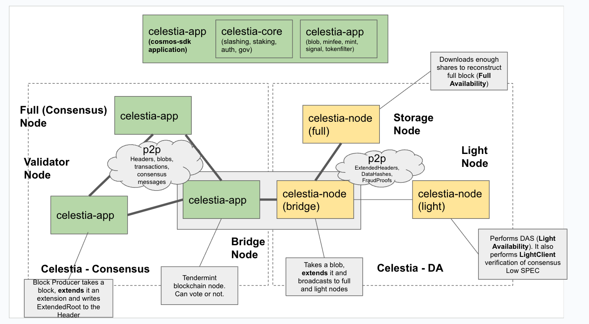

<!-- START doctoc generated TOC please keep comment here to allow auto update -->
<!-- DON'T EDIT THIS SECTION, INSTEAD RE-RUN doctoc TO UPDATE -->
**Table of Contents**

- [Celestia](#celestia)
  - [Overview](#overview)
  - [Core Concepts](#core-concepts)
  - [Network Architecture](#network-architecture)
  - [Blob Lifecycle](#blob-lifecycle)

<!-- END doctoc generated TOC please keep comment here to allow auto update -->

# Celestia

Celestia is a public network designed to provide data availability at scale. It separates the consensus and data availability layers from execution, allowing rollups to post their transaction data to Celestia for ordering and guaranteed availability without being constrained by the execution capacity of a monolithic chain.

## Overview

Celestia primarily focuses on data availability, and its primary function is to make blob data available to anyone who needs it. This is achieved through a combination of data availability sampling (DAS) and a Tendermint-based proof-of-stake consensus mechanism.

## Core Concepts

- **Data Availability Sampling (DAS):** Celestia's light nodes use DAS to verify that all data for a block has been published with high probability, without needing to download the entire block. This allows for a secure and scalable network of light nodes.
- **Erasure Coding:** Block data is erasure coded, adding redundancy that allows for the reconstruction of the full block data even if a significant portion is missing. This is fundamental to making DAS effective.
- **PayForBlob Transactions:** Users submit data to Celestia via a special transaction type called `PayForBlob`, which separates the data payload from the transaction metadata.

## Network Architecture

<figure>
  
    <figcaption>Celestia architecture overview.</figcaption>
</figure>

## Blob Lifecycle

The process of getting data onto Celestia and ensuring its availability involves several key stages. For a detailed explanation of this process, see [Blob Lifecycle](./blob_lifecycle.md).

1.  **Submission:** A user submits a `PayForBlob` transaction to the network.
2.  **Encoding:** The block producer arranges the data into shares, applies 2D Reed-Solomon erasure coding, and generates a data availability root (`availableDataRoot`).
3.  **Propagation:** The proposed block is propagated through the network. Validators download all data to verify the block, while light nodes perform DAS on the block header.
4.  **Finality:** The block is finalized on Celestia via Tendermint consensus. For L2s on other chains like Ethereum, finality is achieved when a proof of data availability is verified on the settlement layer via the Blobstream bridge.

