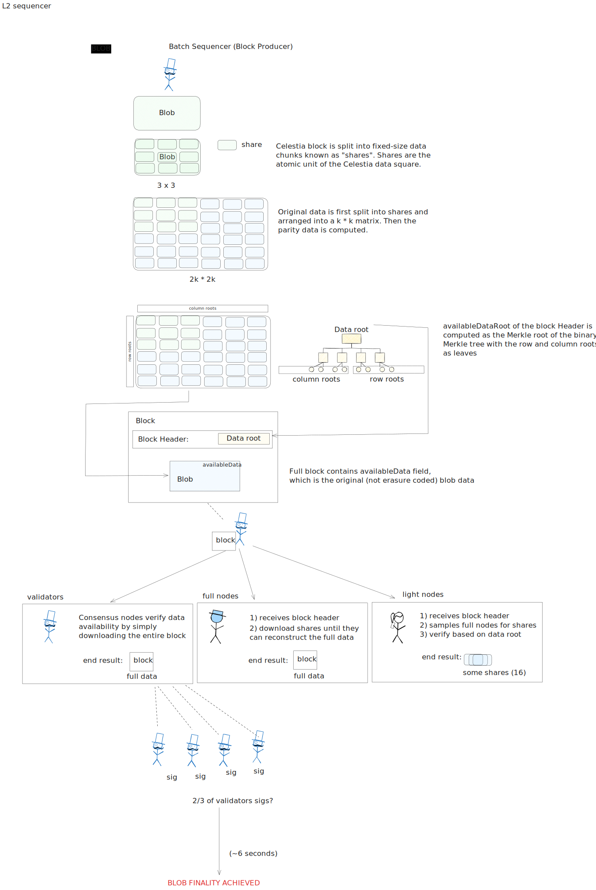

<!-- START doctoc generated TOC please keep comment here to allow auto update -->
<!-- DON'T EDIT THIS SECTION, INSTEAD RE-RUN doctoc TO UPDATE -->
**Table of Contents**

- [How Celestia Works](#how-celestia-works)
  - [Blob Submission](#blob-submission)
  - [Encoding and Batching](#encoding-and-batching)
      - [Block Data Structure](#block-data-structure)
  - [Blob Propagation](#blob-propagation)
  - [Blob Finality](#blob-finality)

<!-- END doctoc generated TOC please keep comment here to allow auto update -->

# How Celestia Works

This document provides a high-level overview of how Celestia handles blob submission, from the moment a user submits a blob to the moment it's finalized on the network. For a deeper dive into the technical details, you can refer to the [official Celestia App specifications](https://celestiaorg.github.io/celestia-app/).

<figure>
  
    <figcaption>Celestia blob lifecycle from submission to finality.</figcaption>
</figure>

*A diagram illustrating the lifecycle of a blob on Celestia.*

## Blob Submission

The lifecycle begins when a user, often an L2 sequencer, submits data to the Celestia network by sending a `PayForBlob` transaction. This special transaction type is used to pay the fees for one or more blobs to be included in a block. The `PayForBlob` transaction itself contains metadata, while the raw blob data is sent alongside it to be picked up by the current block producer. This design efficiently separates the transaction logic from the larger data payload. 

## Encoding and Batching

The block producer is responsible for packaging blobs into a block. This is a multi-step process designed to ensure data availability.

1.  **Share Creation**: The block producer takes the raw blob data, along with other standard transactions, and splits it into fixed-size units called "shares".

2.  **Data Squaring**: These shares are arranged into a `k x k` matrix, known as the "original data square".

3.  **Erasure Coding**: To create redundancy, the block producer applies a 2D Reed-Solomon erasure coding scheme. This extends the `k x k` original data square into a larger `2k x 2k` "extended data square" by adding parity data. This process ensures that the original data can be fully reconstructed from any 50% of the shares from each row or column.

4.  **Data Root Calculation**: The producer computes Merkle roots for each row and column of the `2k x 2k` extended square. These row and column roots are then themselves Merkle-ized to create a single `availableDataRoot`.

5.  **Block Creation**: The final block is assembled. It contains:
    *   A `Block Header`, which includes the `availableDataRoot` as a commitment to the data.
    *   The `availableData` field, which contains the original, non-erasure-coded transaction and blob data.

#### Block Data Structure

A Celestia block's structure is specifically designed for data availability. The main components are:

*   **`Header`**: This contains standard block metadata like `height` and `timestamp`, but critically includes the `availableDataRoot`. This root is the single commitment that light clients use to verify data availability through Data Availability Sampling.
*   **`AvailableDataHeader`**: This contains the lists of `rowRoots` and `colRoots` from the extended data square. The `availableDataRoot` is the Merkle root of these two lists combined.
*   **`AvailableData`**: This field holds the actual data submitted by users. It is separated into `transactions` (standard Cosmos SDK transactions), `payForBlobData` (the transactions that pay for blobs), and `blobData` (the raw blob content). Validators and full nodes use this original data to reconstruct the extended square and verify it against the `availableDataRoot`.
*   **`LastCommit`**: This contains the validator signatures from the previous block, securing the chain's history, as is typical in Tendermint-based consensus.

The core logic for this process in `celestia-app` can be found in the [`PrepareProposal` function](https://github.com/celestiaorg/celestia-app/blob/b768c4417b17e887a0104bd869dbb5579e9de9ec/app/prepare_proposal.go#L74).

## Blob Propagation

Once a block is proposed, it is propagated across the network. Different types of nodes interact with the block differently to verify data availability.

*   **Validators (Consensus Nodes)**: These nodes ensure the validity of the proposed block. They download the *entire* blob data from the `availableData` field, re-compute the extended data square, and verify that the resulting `availableDataRoot` matches the one in the block header. This comprehensive check is performed in the [`ProcessProposal` function](https://github.com/celestiaorg/celestia-app/blob/b768c4417b17e887a0104bd869dbb5579e9de9ec/app/process_proposal.go#L160).

*   **Full Nodes (DA)**: These are nodes running the [`celestia-node`](https://github.com/celestiaorg/celestia-node) software. After a block is finalized by the consensus validators, full nodes receive it. They also re-process the block's `availableData`, recreate the extended data square, and verify that its root matches the `availableDataRoot` in the header. This verification is a critical step before they make the individual shares of the extended square available on the P2P network for light nodes to sample. This verification logic can be seen in the [`header` package](https://github.com/celestiaorg/celestia-node/blob/2114324e0801c61f631000a2982dda6441260a13/header/header.go#L140).

*   **Light Nodes (DA)**: Light nodes, also running [`celestia-node`](https://github.com/celestiaorg/celestia-node), provide security with minimal resource requirements. Instead of downloading the whole block, they perform **Data Availability Sampling (DAS)**:
    1.  They download only the `Block Header`.
    2.  They randomly sample small chunks (shares) of the extended data square from Full DA nodes.
    3.  For each received share, they use the row and column roots from the header to verify the share's integrity and its correct placement in the square.

    By successfully verifying a small number of random samples, a light node can ascertain with very high probability that the entire block's data was published and is available, without ever downloading it.

## Blob Finality

Blob finality is achieved through the consensus mechanism.

1.  **Attestation**: After a validator successfully verifies a block's data availability, it signs the block with its signature, creating an attestation.

2.  **Consensus**: These signatures are broadcast to the rest of the network. When validators representing at least 2/3 of the total voting power have signed the block, it is considered final.

Once a block is finalized, the blobs within it are permanently and verifiably stored on the Celestia blockchain.
