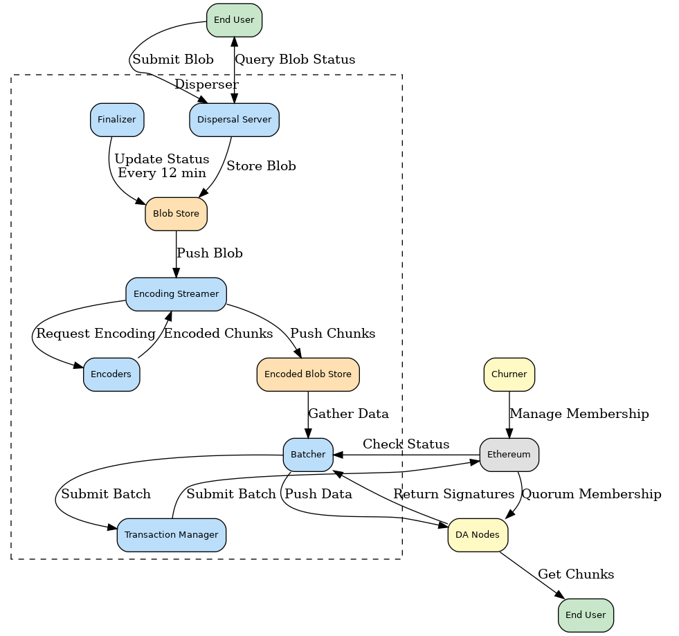

<!-- START doctoc generated TOC please keep comment here to allow auto update -->
<!-- DON'T EDIT THIS SECTION, INSTEAD RE-RUN doctoc TO UPDATE -->
**Table of Contents**

- [EigenDA](#eigenda)
  - [Overview](#overview)
  - [Core Concepts](#core-concepts)
  - [Network Architecture](#network-architecture)
  - [Blob Lifecycle](#blob-lifecycle)

<!-- END doctoc generated TOC please keep comment here to allow auto update -->

# EigenDA

EigenDA is a data availability (DA) service built on top of EigenLayer, designed to provide high-throughput, scalable, and secure data availability for rollups. It leverages Ethereum's economic security through the mechanism of restaking, where Ethereum stakers can opt-in to validate additional services like EigenDA.

## Overview

EigenDA's architecture is centered around a **Disperser** and a network of **EigenLayer operators**. Rollups submit their data to the Disperser, which then encodes and distributes it among the operators. These operators store the data chunks and provide attestations of availability. The system is horizontally scalable, meaning throughput can be increased by adding more operators to the network. The final proof of data availability is anchored to Ethereum for verification.

## Core Concepts

- **Disperser:** A trusted, centralized component responsible for accepting blobs, performing erasure coding, generating KZG commitments, and dispersing data chunks to operator nodes.
- **EigenLayer Operators:** Nodes run by restakers who opt-in to the EigenDA service. They are responsible for storing data chunks and providing signatures to attest to data availability.
- **KZG Commitments:** EigenDA uses KZG commitments to ensure data integrity and allow for efficient verification of data chunks.
- **Erasure Coding:** Blobs are erasure coded into chunks, providing redundancy and ensuring the original data can be reconstructed even if some chunks are unavailable.
- **Data Availability Certificate:** An aggregated signature from operators (e.g., a BLS signature) that serves as a cryptographic proof of data availability. This certificate can be verified by smart contracts on Ethereum.

## Network Architecture

<figure>
  
    <figcaption>Disperser architecture overview (EigenDA V1).</figcaption>
</figure>

## Blob Lifecycle

The process of publishing data to EigenDA and achieving finality involves several key steps. For a detailed explanation of this process, see [Blob Lifecycle](./blob_lifecycle.md).

1.  **Submission:** A rollup sequencer submits blob data to the Disperser service.
2.  **Encoding and Batching:** The Disperser erasure codes the blob, generates KZG commitments, and packages it into a batch with other blobs.
3.  **Propagation and Attestation:** The Disperser pushes the data chunks directly to the assigned operators. Each operator verifies its chunk, stores it, and returns a signature attesting to its availability.
4.  **Finality:** The Disperser aggregates the operator signatures into a Data Availability Certificate. This certificate can be posted and verified on the settlement layer (Ethereum), allowing a rollup's smart contracts to confirm that its transaction data is available.
