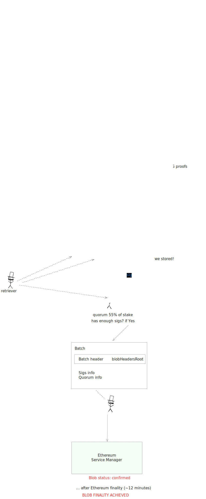

<!-- START doctoc generated TOC please keep comment here to allow auto update -->
<!-- DON'T EDIT THIS SECTION, INSTEAD RE-RUN doctoc TO UPDATE -->
**Table of Contents**

- [Blob Lifecycle](#blob-lifecycle)
  - [Blob Submission](#blob-submission)
  - [Encoding and Batching](#encoding-and-batching)
    - [Data Structures](#data-structures)
  - [Blob Propagation and Attestation](#blob-propagation-and-attestation)
  - [Blob Finality](#blob-finality)
    - [1. Finality on EigenDA](#1-finality-on-eigenda)
    - [2. Finality on the Settlement Layer](#2-finality-on-the-settlement-layer)

<!-- END doctoc generated TOC please keep comment here to allow auto update -->

# Blob Lifecycle

This document provides a high-level overview of how EigenDA handles blob submission, from the moment a user submits a blob to its final confirmation of availability on Ethereum.

<figure>
  
    <figcaption>EigenDA blob lifecycle from submission to finality.</figcaption>
</figure>

*A diagram illustrating the lifecycle of a blob on EigenDA.*

## Blob Submission

The lifecycle of a blob in EigenDA begins when a client, typically an L2 sequencer, submits data to the EigenDA **Disperser** service. The Disperser exposes a gRPC interface for blob submission. To simplify this process, rollups often use a client library or the provided REST proxy, which handles the raw gRPC calls, payment, and status polling.

When the Disperser receives a submission, it registers a new blob entry and assigns it a pending status while it prepares the blob for encoding and distribution across the node operators network.

## Encoding and Batching

Once a blob is accepted, the Disperser processes it to ensure data availability. This involves several steps:

1.  **Erasure Coding**: The Disperser uses Reed-Solomon encoding to split the blob into multiple smaller pieces called "chunks". This process adds redundancy, ensuring that the original blob can be reconstructed from a sufficiently large subset of these chunks.

2.  **KZG Commitments**: To ensure data integrity, the Disperser generates KZG (Kate-Zaverucha-Goldberg) polynomial commitments for the blob. This includes:
    *   A commitment to the polynomial representing the blob's data.
    *   A proof confirming the polynomial's degree, which validates the blob's size.
    *   KZG opening proofs for each chunk, which allow any node to efficiently verify that a given chunk is part of the committed blob.

3.  **Batching**: For efficiency, the Disperser can bundle multiple blobs into a single batch. It then creates a `BatchHeader` for this collection, which contains:
    *   A `batch_root`: A 32-byte Merkle root or hash that commits to all blobs within the batch.
    *   A `reference_block_number`: An Ethereum L1 block number that anchors the batch's attestation to the settlement layer. The Disperser will encode and disperse the blobs based on the onchain info (e.g. operator stakes) at this block number.

### Data Structures

EigenDA uses a set of nested data structures to organize and secure blob data throughout its lifecycle.

*   **`BlobHeader`**: Provided at submission, this contains the blob's version, metadata about the EigenDA quorum responsible for storing it, and its KZG commitments. These commitments are crucial for verifying the blob's size and content integrity.

*   **`BlobCertificate`**: For each blob in a batch, the Disperser creates a certificate. It encapsulates the `BlobHeader` and additional dispersal information, such as the identities of the validator nodes (operators) assigned to store each chunk.

*   **`SignedBatch`**: This structure finalizes the batch. It contains the `BatchHeader` and, eventually, an aggregated signature from the validators who have attested to storing their assigned chunks. Validators sign the batch as a whole rather than individual blobs.

At this point, the blobs have been encoded and packaged, and their status transitions to await attestations from the validators.

## Blob Propagation and Attestation

With the data prepared, the Disperser distributes the chunks to the EigenDA operator nodes (validators) for storage and validation.

*   **Direct Push Model**: Unlike gossip-based protocols, EigenDA uses a direct "push" model. The Disperser sends each chunk directly to the specific validator responsible for storing it. This approach is designed for efficiency and horizontal scalability, as each validator only needs to store a small fraction of each blob.

*   **Chunk Verification**: Along with each chunk, the Disperser sends the corresponding KZG proof. Upon receiving its assigned chunk, a validator uses this proof and the blob's public commitment (from the `BlobHeader`) to cryptographically verify that the chunk is authentic and correct.

*   **Storage and Attestation**: After successful verification, the validator stores the chunk locally. It then signs an attestation confirming that it holds its portion of the data and sends this signature back to the Disperser.

The Disperser gathers these individual attestations. Once a sufficient number of signatures have been collected to meet EigenDA's liveness and safety threshold, the blob is considered available and ready to be published to Ethereum.

## Blob Finality

A blob's journey concludes with a two-stage finality process, ensuring its availability is guaranteed by EigenDA and verifiable on the settlement layer (Ethereum).

### 1. Finality on EigenDA

Finality within the EigenDA system is achieved when the Disperser successfully aggregates a sufficient number of validator signatures.

1.  **Signature Aggregation**: The Disperser collects the individual signatures (e.g., BLS signatures) from validators and aggregates them into a single, compact signature for the entire batch.

2.  **Certificate Creation**: This aggregated signature is combined with the `BatchHeader` and metadata about the signing quorum (e.g., a bitmap of signers and non-signers) to create a **Data Availability Certificate**.

3.  **Confirmation**: The certificate is only considered valid once it meets EigenDA's safety threshold, meaning a large enough fraction of validator stake has attested to the data's availability. At this stage, the blob's status is updated to `Confirmed` or `Finalized`. The certificate now serves as a portable, cryptographic proof of availability for the batch.

### 2. Finality on the Settlement Layer

For a rollup on Ethereum to use the blob data, it needs proof on Ethereum that the data was published to EigenDA. This is accomplished by bridging the Data Availability Certificate to the settlement layer.

1.  **Relaying to L1**: A client, such as the rollup itself, can post the `BatchHeader` and the aggregated signature to the EigenDA smart contracts on Ethereum.

2.  **L1 Verification**: The EigenDA contracts, which are part of the broader EigenLayer protocol, verify the submitted proof. They check the aggregated signature against the registered set of operators and their corresponding stake, confirming that the amount of stake declared in the tx input has indeed attested to the data. Currently, no minimum stake threshold is enforced, meaning that a batch can be confirmed on Ethereum with lower than the minimum safety threshold of 55%. It is responsibility of the L2 to check that their blob's batch meets their desired safety threshold.

Once the certificate is verified on-chain, the blob's data is considered final and can be used by the L2's L1 contracts for state updates or other operations. 