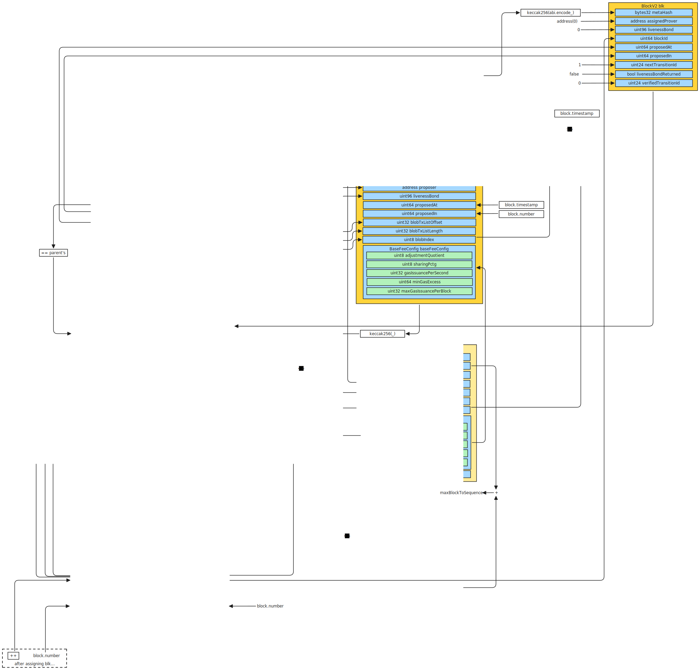

<!-- START doctoc generated TOC please keep comment here to allow auto update -->
<!-- DON'T EDIT THIS SECTION, INSTEAD RE-RUN doctoc TO UPDATE -->
**Table of Contents**

- [Sequencing](#sequencing)
  - [High-level flow](#high-level-flow)
  - [The `storeForcedInclusion` function](#the-storeforcedinclusion-function)
  - [The `proposeBatch` function](#the-proposebatch-function)

<!-- END doctoc generated TOC please keep comment here to allow auto update -->

# Sequencing

## High-level flow

Blocks can be sequenced by everyone unless a `preconfTaskManager` is set. Every block references a `anchorBlockId`, which indicates the latest L1 state that the L2 block is based on. The `anchorBlockId` cannot be more than `maxAnchorHeightOffset` blocks behind the current block, and should be greater or equal the parent's one. Each block's `parentMetaHash` must match the `metaHash` of the parent block. Every time a block is sequenced, a liveness bond is taken from the proposer, which is slashed if the block is not proven in time.

## The `storeForcedInclusion` function

This function on the `ForcedInclusionStore` contract allows to enqueue forced transactions and bypass preconfer censorship. It is defined as follows:

```solidity
function storeForcedInclusion(
        uint8 blobIndex,
        uint32 blobByteOffset,
        uint32 blobByteSize
    )
        external
        payable
        onlyStandaloneTx
        whenNotPaused
```

All transactions must pay a `feeInGwei` fee to get included. Each forced inclusion call creates a `ForcedInclusion` structure, which is defined as follows:

```solidity
struct ForcedInclusion {
    bytes32 blobHash;
    uint64 feeInGwei;
    uint64 createdAtBatchId;
    uint32 blobByteOffset;
    uint32 blobByteSize;
    uint64 blobCreatedIn;
}
```

The `createdAtBatchId` value is set to the next batch id, and the `blobCreatedIn` value is set to the current block number. A forced inclusion deadline is defined as being `inclusionDelay` batches away from either the last time a forced inclusion was processed, or the time the forced inclusion request was created, whichever is newer. In practice this means that the slowest that forced transactions are processed is every `inclusionDelay` batches unless the next forced inclusion request to be processed is newer. This mechanism potentially opens to the possibility of a spam attack that delays all forced transactions.

## The `proposeBatch` function

<figure>
     // TODO: update with new one
    <figcaption>Structures and checks involved when sequencing a batch.</figcaption>
</figure>

This function on the `inboxWrapper` contract is the main entry point to sequence blocks on Taiko Alethia. If a `preconfRouter` is set, then it must be the `msg.sender`. The function is defined as follows:

```solidity
function proposeBatch(
    bytes calldata _params,
    bytes calldata _txList
)
    external
    onlyFromOptional(preconfRouter)
    nonReentrant
    returns (ITaikoInbox.BatchInfo memory, ITaikoInbox.BatchMetadata memory)
```

The `_params` value is split into two parts, where the first part is intended to contain forced transactions, and the second part regular L2 sequenced transactions. The first part can be empty only if the oldest forced transaction is not over the force inclusion deadline. The function enforces that only one block can be proposed, and that the block contains at least `MIN_TXS_PER_FORCED_INCLUSION` transactions, among other routine checks. After this, the two parts follow the usual `proposeBlock` flow, separately.

The function fetches the current config, which is hardcoded in the contract, and calls the `proposeBlock` function of the `LibProposing` library. Specifically for Taiko Alethia, the config is defined as follows:

```solidity
function pacayaConfig() public pure override returns (ITaikoInbox.Config memory) {
    // All hard-coded configurations:
    // - treasury: the actual TaikoL2 address.
    // - anchorGasLimit: 1_000_000
    return ITaikoInbox.Config({
        chainId: LibNetwork.TAIKO_MAINNET,
        // Ring buffers are being reused on the mainnet, therefore the following two
        // configuration values must NEVER be changed!!!
        maxUnverifiedBatches: 324_000, // DO NOT CHANGE!!!
        batchRingBufferSize: 360_000, // DO NOT CHANGE!!!
        maxBatchesToVerify: 16,
        blockMaxGasLimit: 240_000_000,
        livenessBondBase: 125e18, // 125 Taiko token per batch
        livenessBondPerBlock: 0, // deprecated
        stateRootSyncInternal: 4,
        maxAnchorHeightOffset: 64,
        baseFeeConfig: LibSharedData.BaseFeeConfig({
            adjustmentQuotient: 8,
            sharingPctg: 50,
            gasIssuancePerSecond: 5_000_000,
            minGasExcess: 1_344_899_430, // 0.01 gwei
            maxGasIssuancePerBlock: 600_000_000 // two minutes: 5_000_000 * 120
         }),
        provingWindow: 2 hours,
        cooldownWindow: 2 hours,
        maxSignalsToReceive: 16,
        maxBlocksPerBatch: 768,
        forkHeights: ITaikoInbox.ForkHeights({
            ontake: 538_304,
            pacaya: 1_166_000,
            shasta: 0,
            unzen: 0
        })
    });
}
```

The contract stores the latest state in the `state` variable, which is a `State` structure defined as follows:

```solidity
struct State {
    // Ring buffer for proposed batches and a some recent verified batches.
    mapping(uint256 batchId_mod_batchRingBufferSize => Batch batch) batches;
    // Indexing to transition ids (ring buffer not possible)
    mapping(uint256 batchId => mapping(bytes32 parentHash => uint24 transitionId)) transitionIds;
    // Ring buffer for transitions
    mapping(
        uint256 batchId_mod_batchRingBufferSize
            => mapping(uint24 transitionId => TransitionState ts)
    ) transitions;
    bytes32 __reserve1; // slot 4 - was used as a ring buffer for Ether deposits
    Stats1 stats1; // slot 5
    Stats2 stats2; // slot 6
    mapping(address account => uint256 bond) bondBalance;
    uint256[43] __gap;
}
```

where `Stats1` and `State2` are defined as follows:

```solidity
struct Stats1 {
    uint64 genesisHeight;
    uint64 __reserved2;
    uint64 lastSyncedBatchId;
    uint64 lastSyncedAt;
}

struct Stats2 {
    uint64 numBatches;
    uint64 lastVerifiedBatchId;
    bool paused;
    uint56 lastProposedIn;
    uint64 lastUnpausedAt;
}
```

and `Batch` is defined as follows:

```solidity
struct Batch {
    bytes32 metaHash; // slot 1
    uint64 lastBlockId; // slot 2
    uint96 reserved3;
    uint96 livenessBond;
    uint64 batchId; // slot 3
    uint64 lastBlockTimestamp;
    uint64 anchorBlockId;
    uint24 nextTransitionId;
    uint8 reserved4;
    // The ID of the transaction that is used to verify this batch. However, if this batch is
    // not verified as the last one in a transaction, verifiedTransitionId will remain zero.
    uint24 verifiedTransitionId;
}
```

and `TransitionState` is defined as follows:

```solidity
struct TransitionState {
    bytes32 parentHash;
    bytes32 blockHash;
    bytes32 stateRoot;
    address prover;
    bool inProvingWindow;
    uint48 createdAt;
}
```

The control then passes to the `MainnetInbox`'s `proposeBatch` function. It is first checked that `numBatches` is equal or greater than the `config.forkHeights.pacaya` value. The term "Pacaya" refers to the [Pacaya upgrade](https://docs.taiko.xyz/taiko-alethia-protocol/protocol-design/pacaya-fork-taiko-alethia/). It is then checked that the `numBatches` is less than `lastVerifiedBatchId + maxBatchesToVerify + 1`, which means that blocks cannot be proposed if sequenced batches are too much ahead of the last verified batch.

The `_params` are then decoded into a `BatchParams` structure, which is defined as follows:

```solidity
struct BatchParams {
    address proposer;
    address coinbase;
    bytes32 parentMetaHash;
    uint64 anchorBlockId;
    uint64 lastBlockTimestamp;
    bool revertIfNotFirstProposal;
    // Specifies the number of blocks to be generated from this batch.
    BlobParams blobParams;
    BlockParams[] blocks;
}
```

where `BlobParams` and `BlockParams` are defined as follows:

```solidity
struct BlobParams {
        // The hashes of the blob. Note that if this array is not empty.  `firstBlobIndex` and
        // `numBlobs` must be 0.
        bytes32[] blobHashes;
        // The index of the first blob in this batch.
        uint8 firstBlobIndex;
        // The number of blobs in this batch. Blobs are initially concatenated and subsequently
        // decompressed via Zlib.
        uint8 numBlobs;
        // The byte offset of the blob in the batch.
        uint32 byteOffset;
        // The byte size of the blob.
        uint32 byteSize;
        // The block number when the blob was created. This value is only non-zero when
        // `blobHashes` are non-empty.
        uint64 createdIn;
    }

struct BlockParams {
        // the max number of transactions in this block. Note that if there are not enough
        // transactions in calldata or blobs, the block will contains as many transactions as
        // possible.
        uint16 numTransactions;
        // The time difference (in seconds) between the timestamp of this block and
        // the timestamp of the parent block in the same batch. For the first block in a batch,
        // there is not parent block in the same batch, so the time shift should be 0.
        uint8 timeShift;
        // Signals sent on L1 and need to sync to this L2 block.
        bytes32[] signalSlots;
    }
```

Default values for `proposer`, `coinbase`, `anchorBlockId` and `lastBlockTimestamp` are set if not provided, specifically `msg.sender`, `msg.sender`, the block number previous to the current one, and the current block timestamp. It is checked that the `anchorBlockId` is less than the current block number, but not more than `maxAnchorHeightOffset` behind. It is checked that the current `anchorBlockId` is greater than the parents' `anchorBlockId`. The same check is then performed using the `_params`'s `timestamp` value. It is checked that the timestamp in which the current block is proposed is later than the timestamp of the parent block. The `timeShift` of the first block must be zero, and the total `timeShift` across blocks must be less than the `lastBlockTimestamp`, and the first block timestamp (calculated as `lastBlockTimestamp` minus the total `timeShift`) should be less than `maxAnchorHeightOffset` times L1 block time in the past. The timestamp of the first block must be greater than the timestamp of the last block in the parent batch.

It is then checked that the `parentMetaHash` corresponds to the parent's `metaHash`, or it's zero.

Then, a `BatchInfo` structure is created, which is defined as follows:

```solidity
struct BatchInfo {
    bytes32 txsHash;
    // Data to build L2 blocks
    BlockParams[] blocks;
    bytes32[] blobHashes;
    bytes32 extraData;
    address coinbase;
    uint64 proposedIn; // Used by node/client
    uint64 blobCreatedIn;
    uint32 blobByteOffset;
    uint32 blobByteSize;
    uint32 gasLimit;
    uint64 lastBlockId;
    uint64 lastBlockTimestamp;
    // Data for the L2 anchor transaction, shared by all blocks in the batch
    uint64 anchorBlockId;
    // corresponds to the `_anchorStateRoot` parameter in the anchor transaction.
    // The batch's validity proof shall verify the integrity of these two values.
    bytes32 anchorBlockHash;
    LibSharedData.BaseFeeConfig baseFeeConfig;
}
```

It is recommended to check the diagram above to understand how it is constructed. A `Batch` structure is also populated to be then saved in the `batches` mapping under the `numBatches % batchRingBufferSize` key. A `verifiedTransitionId` of 0 and a `nextTransitionId` of 1 means that a batch has been sequenced but not yet proven. Then the `numBatches` is incremented, and the `lastProposedIn` is set to the current block number. Finally, the `debitBond` function is called to collect the liveness bond, which is slashed if the proposed block doesn't get timely proven. The token used is the `_bondToken`, and the amount is the `livenessBond` value.

The `verifyBlock` function is then called, which is discussed in the [proof system](proof_system.md) page.


