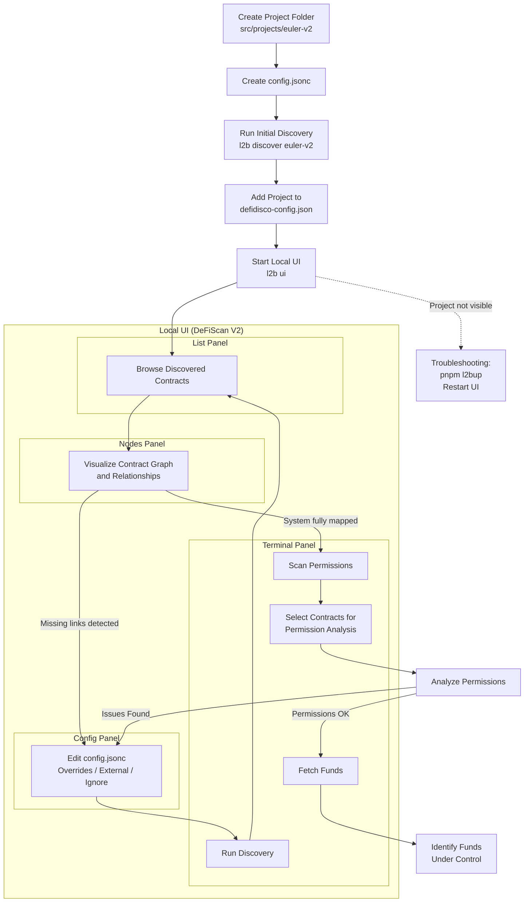

# Getting Started

This guide walks you through setting up DeFiScan V2 and analyzing your first DeFi protocol with our tool.

## Installation

Clone the repository and install dependencies:

```bash
git clone https://github.com/deficollective/defi-disco.git
cd defi-disco
pnpm i
cd packages/l2b
pnpm l2bup
```

## Configuration

### Environment Setup

Create a `.env` file inside the `packages/config` folder:

```bash
cd ../config
```

Add the following environment variables to `.env`:

```env
ETHERSCAN_API_KEY=your_etherscan_api_key
ETHEREUM_RPC_URL_FOR_DISCOVERY=https://your-rpc-url
```

### Project Configuration

1. Create a new project folder inside `./packages/config/src/projects`:

```bash
mkdir -p src/projects/euler-v2
```

2. Create a `config.jsonc` file in your project folder:

```jsonc
{
  "$schema": "../../../../discovery/schemas/config.v2.schema.json",
  "name": "euler-v2",
  "import": ["../globalConfig.jsonc"],
  "initialAddresses": ["eth:0x35400831044167E9E2DE613d26515eeE37e30a1b"],
  "defidisco": {
    "scanPermissions": false,
    "permissionLimits": {
      "maxSourceFiles": 35
    }
  },
  "overrides": {
    "eth:0xae7ab96520DE3A18E5e111B5EaAb095312D7fE84": {
      "ignoreDiscovery": true
    }
  }
}
```

## Running Discovery

Execute the discovery process from the `packages/config` directory:

```bash
l2b discover euler-v2
```

**Note:** Discovery must always be run from the `./packages/config` directory.


## Continue Analysis

After first run, we suggest you to start the local UI to facilitate discovery of the entire DeFi project.

To see the project in the UI, head to `packages/config/src/defidisco-config.json` and add the project name (make sure same as folder name).

```json
{
  "version": "1.0",
  "description": "DeFiScan V2 configuration for DeFi project filtering",
  "defiProjects": [
    "compound-v3",
    "uniswap-v2",
    "morpho",
    "lido",
    "liquity-v2",
    "euler-v2" <--- here
  ],
  "lastUpdated": "2026-01-09"
}

```

Then run:

```bash
l2b ui
```

**Troubleshooting ⚠️** 

> If the project does not show up in the local app, stop the app, run `pnpm l2bup` inside the `packages/config` folder, and restart the service.

## Discovery

Using 4 panels

- list
- nodes
- terminal
- config

You go through the discovered contracts (with list and nodes), see if there are missing links to other system relevant contracts, you mark contract as external if you find oracles/bridges/yield sources etc.

Then you adapt the `config.jsonc`, once you're satisfied to run another discovery episode, you select the terminal view and you press `Run discovery`.

## Permission Analysis

When you think you have the whole system mapped, choose the `Scan Permissions` button inside the terminal. This will allow you to select the contracts for which you want permissions to be analysed.

## Track Funds

Once you have a clear overview of the permissions, it's important to know which funds are controlled by these permissions.


Start by marking which contract you want funds data on using the `Nodes` panel of the UI. You can decide to fetch all balances or DeFi positions for a given contract, and/or mark it as a token contract to know its the token price and market capitalization. Use the button `Fetch Funds` inside the terminal to fetch the data. Make sure the DeFiScan API service is running.

## DeFiScan Panel

After running discovery, scanning permissions, and fetching funds, open the DeFiScan panel to see the scoring dashboard. This panel combines all collected data into a structured breakdown.

## Flow Chart

