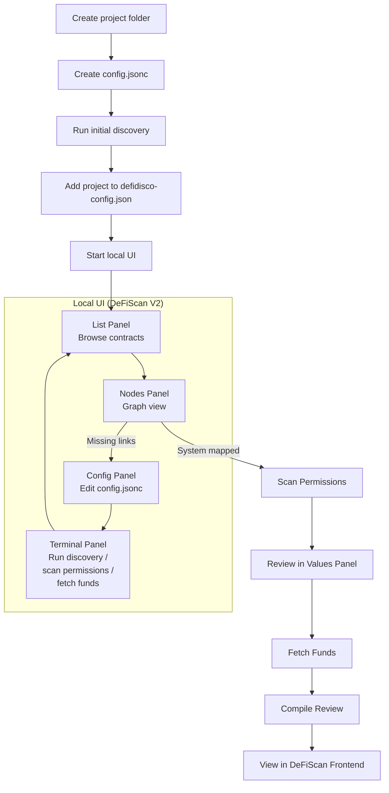

# Getting Started

This guide walks you through setting up DeFiScan V2 and analyzing your first DeFi protocol.

## Installation

```bash
git clone https://github.com/deficollective/defi-disco.git
cd defi-disco
pnpm i
cd packages/l2b
pnpm l2bup
```

## Environment Variables

Create a `.env` file inside `packages/config`:

```env
ETHERSCAN_API_KEY=your_etherscan_api_key
ETHEREUM_RPC_URL_FOR_DISCOVERY=https://your-rpc-url

# At least one of these is required for AI-assisted permission detection
OPENAI_API_KEY=...
ANTHROPIC_API_KEY=...
```

> **ℹ️ Agent-assisted workflows**
>
> The DeFi Collective maintains a set of specialized Claude Code skills for agent-assisted protocol discovery, permission scanning, scoring, resource gathering, and review generation. They live in a separate private repository and are not shipped with this codebase. If you have access, they can dramatically speed up the workflows described below — otherwise, every step can still be performed manually in the UI.

## Analyze your first protocol

The tool offers two entry points: work directly with files and the terminal, or start the UI. For the initial exploration of an unfamiliar protocol the UI is strongly recommended. If you already know the protocol well, starting from a `config.jsonc` gives you more upfront control.

### Start with the UI

```bash
pnpm l2b ui
```

Open `http://localhost:2021/ui`. Use the `+` button to create a new project: enter the protocol name and one or more initial addresses. Addresses must be chain-prefixed (`eth:0x...` on mainnet). The list of supported chain prefixes is defined in [ChainSpecificAddress.ts](https://github.com/deficollective/defi-disco/blob/main/packages/shared-pure/src/types/ChainSpecificAddress.ts#L14).

### Start with the CLI

1. Create a project folder inside `packages/config/src/projects`:

   ```bash
   mkdir -p packages/config/src/projects/euler-v2
   ```

2. Create `config.jsonc`:

   ```jsonc
   {
     "$schema": "../../../../discovery/schemas/config.v2.schema.json",
     "name": "euler-v2",
     "import": ["../globalConfig.jsonc"],
     "initialAddresses": ["eth:0x35400831044167E9E2DE613d26515eeE37e30a1b"],
     "overrides": {
       "eth:0xae7ab96520DE3A18E5e111B5EaAb095312D7fE84": {
         "ignoreDiscovery": true
       }
     }
   }
   ```

3. Run discovery from the `packages/config` directory:

   ```bash
   l2b discover euler-v2
   ```

> **Note:** Discovery must always be run from `packages/config`.

### Make the project visible in the UI

Add the project name to `packages/config/src/defidisco-config.json` under `defiProjects`, then start the UI:

```bash
pnpm l2b ui
```

> **Troubleshooting:** If the project does not show up, stop the app, run `pnpm l2bup` inside `packages/config`, and restart.

## Discovery

DeFiScan V2's core UI has four panels: **list**, **nodes**, **terminal**, and **config**. Browse discovered contracts in the list and nodes views, spot missing links to system-relevant contracts, and tag contracts as *external* when they belong to other protocols (oracles, bridges, yield sources, etc.).

When you need more contracts scanned, edit `config.jsonc` in the config panel and click **Run discovery** in the terminal panel.

## Working with Factory Patterns (Templates)

Protocols that deploy many contracts with identical bytecode (Uniswap pools, Euler vaults, etc.) can be analyzed consistently using **templates**. You configure a template once, and discovery automatically applies it to every contract with matching bytecode.

### How templates work

- Discovery matches contracts by **bytecode hash**
- You only need **one example contract** to register the hash
- Every contract with matching bytecode receives the template configuration

### Template files

Templates live in `packages/config/src/projects/_templates/`:

| File | Purpose |
|------|---------|
| `template.jsonc` | Fields, handlers, and ignored methods for the contract |
| `shapes.json` | Bytecode hash and one reference deployment |

### Adding a template

1. Create the folder and `template.jsonc`:

   ```bash
   mkdir -p packages/config/src/projects/_templates/euler-v2/EVault
   ```

   ```jsonc
   {
     "$schema": "../../../../../../discovery/schemas/contract.v2.schema.json",
     "displayName": "EVault",
     "description": "Euler V2 EVault",
     "ignoreMethods": ["accumulatedFees", "convertToAssets", "previewDeposit"]
   }
   ```

2. Register the bytecode hash from any deployed instance:

   ```bash
   l2b add-shape ethereum <blockNumber> EVault euler-v2/EVault 0x<vault-address>
   ```

3. Re-run discovery:

   ```bash
   l2b discover euler-v2
   ```

<details>
<summary><strong>⚠️ Proxy factory deployments</strong></summary>

For **proxy contracts**, `l2b add-shape` registers the proxy's bytecode hash if you pass the proxy address — but discovery matches templates against the **implementation hash**. Always pass the implementation address.

If you used the wrong address, open `sourceHashes` in `discovered.json`:

```json
"sourceHashes": [
  "0x03b737c5...",
  "0x1ae4cf8a..."
]
```

Proxy contracts have multiple hashes — discovery skips the first (proxy) and matches subsequent entries. Update `shapes.json` to use the implementation hash (typically the second entry).

</details>

## Permission Analysis

Once the contract graph looks complete, click **Scan Permissions** in the terminal and pick the contracts whose access-controlled functions you want analyzed. The AI detector uses whichever provider key is set in `.env` (`OPENAI_API_KEY` or `ANTHROPIC_API_KEY`). Results are written to `functions.json` and can be reviewed, corrected, and scored directly in the Values panel.

## Call Graph Analysis

Call graph generation requires [Slither](https://github.com/crytic/slither) and the Solidity compilers:

```bash
python3 -m venv ~/.slither-venv
source ~/.slither-venv/bin/activate
pip install slither-analyzer solc-select
solc-select install all
```

> DeFi protocols use a wide range of Solidity versions. Installing all compilers upfront avoids interruptions. If Slither is already installed elsewhere, point `SLITHER_PATH` at your binary.

## Track Funds

Once you have a clear picture of permissions, you want to know what funds those permissions actually control.

> ⚠️ Start the [defiscan-endpoints](https://github.com/deficollective/defiscan-v2/tree/main/packages/defiscan-endpoints) service before fetching funds.

### Mark contracts for funds fetching

In the **Nodes** panel, select a contract and click **Funds** in the bottom toolbar:

| Option | What it fetches | Typical use |
|---|---|---|
| Fetch Token Balances | Tokens held *by* this contract | Treasury, vaults, pools |
| Fetch DeFi Positions | DeFi positions *of* this contract | Contracts depositing into other protocols |
| Token Contract | Market cap and price of the token | Protocol's native token (UNI, AAVE, …) |
| Fetch Aggregate | Total TVL across child contracts | Factory contracts (e.g. Uniswap V2 Factory) |

> "Token Contract" fetches the token's market cap, not its TVL. To see the reserves held by a token contract, also enable "Fetch Token Balances".

> "Fetch Aggregate" requires selecting a handler (e.g. `uniswap-v2-factory`, `frankencoin-mintinghub`). Some handlers need API keys (e.g. `THEGRAPH_API_KEY`). See [Infrastructure: Aggregate Funds](../developers/features/infrastructure.md#aggregate-funds).

### Run the fetch

1. Mark contracts as above
2. Start the endpoints service: `cd packages/defiscan-endpoints && pnpm dev`
3. In the terminal panel, click **Fetch Funds**
4. View results in the **DeFiScan** panel

## DeFiScan Panel

After discovery, permission scanning, and fund fetching, open the **DeFiScan** panel to see the scoring dashboard. It combines all collected data into a structured breakdown of owners, dependencies, and funds at risk.

## Review Builder

The **Review Builder** panel is where you compose the final review document. It writes everything to `review-config.json` (protocol metadata and entity descriptions), with **resources, audits, and governance** stored in sibling files so they survive any regeneration.

1. Open the Review Builder panel
2. Fill in protocol metadata (name, slug, chain, project type, token)
3. Use **Descriptions** to write human-readable descriptions for admins, dependencies, and fund-holding contracts
4. Use **Code & Audits** for data tables and audit references

### Resources and Audits

Use the **Resources** panel to manage project links (frontends, website, documentation, GitHub, X, source code, licenses, DeFiScan V1 reviews). The same panel manages **security audits** and **bug bounty programs** in a separate section below the resource list.

Each audit entry has `author` (auditing firm), `date` (`YYYY-MM`), optional `scope`, and optional `bounty` (max USD payout, used for the Bug Bounty stat in the public frontend).

## Compile and view the review

Once analysis is complete (discovery, permissions, call graph, funds, review config), compile the review and preview it.

### Compile

In the terminal panel, click **Compile Review** to produce `compiled-review.json` — a self-contained artifact containing everything the public frontend needs.

Compile Review also runs a deduplicated **lines-of-code count** (top-level Solidity declarations, deduped by name so inlined libraries don't double-count) and stores it alongside the review. If you only need to refresh the count — for example after changing a contract's external flag — click **Count Lines of Code** in the terminal panel.

**Compile is not the same as "updated"**. The compiled review carries three distinct timestamps: `publishedAt` (set once when you first save `review-config.json`, never changes again), `lastModified` (bumps only when you edit review content — `review-config.json`, `resources.json`, or `governance.json`), and `compiledAt` (the freshness of the on-chain data, which comes from the last discovery run, **not** from the moment you clicked Compile). A recompile without any other change bumps **none** of the three — so clicking Compile a second time to verify output is safe and won't silently reset any dates on the public frontend. A separate "latest activity" timestamp shown on the report hero and footer comes from the newest `activity[]` event, not from any of these three fields.

### Preview in the DeFiScan Frontend

```bash
cp packages/config/src/projects/<project>/compiled-review.json \
   packages/defiscan-frontend/public/data/<slug>/

# Optional: also copy funds data for live balance patching
cp packages/config/src/projects/<project>/funds-data.json \
   packages/defiscan-frontend/public/data/<slug>/

cd packages/defiscan-frontend
pnpm dev
# http://localhost:5173
```

The frontend offers three views per protocol: **Report** (narrative), **Explorer** (data tables), and **Activity** (timeline of changes). The **Gallery** page at `/gallery` shows every reviewed protocol as a card with a radar chart, filters, and pagination.

## Flow


```mermaid
flowchart TD
    A[Create project folder] --> B[Create config.jsonc]
    B --> C[Run initial discovery]
    C --> D[Add project to defidisco-config.json]
    D --> E[Start local UI]

    subgraph UI["Local UI (DeFiScan V2)"]
        direction LR
        F[List Panel<br/>Browse contracts]
        G[Nodes Panel<br/>Graph view]
        H[Config Panel<br/>Edit config.jsonc]
        I[Terminal Panel<br/>Run discovery /<br/>scan permissions /<br/>fetch funds]
    end

    E --> F
    F --> G
    G -->|Missing links| H
    H --> I
    I --> F

    G -->|System mapped| J[Scan Permissions]
    J --> K[Review in Values Panel]
    K --> L[Fetch Funds]
    L --> M[Compile Review]
    M --> N[View in DeFiScan Frontend]
```
