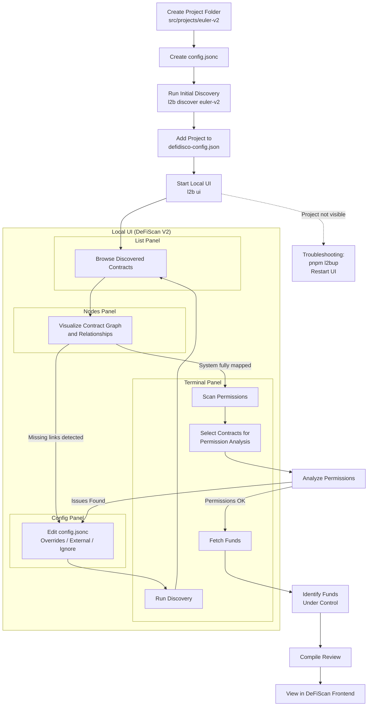

# Getting Started

This guide walks you through setting up DeFiScan V2 and analyzing your first DeFi protocol with our tool.

## Installation

Clone the repository and install dependencies:

```bash
git clone https://github.com/deficollective/defi-disco.git
cd defi-disco
pnpm i
cd packages/l2b
pnpm l2bup
```

## Setup Environment Variables

Create a `.env` file inside the `packages/config` folder:

```bash
cd ../config
```

Add the following environment variables to `.env`:

```env
ETHERSCAN_API_KEY=your_etherscan_api_key
ETHEREUM_RPC_URL_FOR_DISCOVERY=https://your-rpc-url

# at least one of both for AI permission detection
OPENAI_API_KEY=...
ANTHROPIC_API_KEY=...
```

## Analyse your first protocol

The tool gives the researcher two options to start the research process, either through working directly with the files and the terminal or by starting the UI. For deeper analysis the UI is highly recommended. For the initial process however, the terminal is recommended, if the protocol is already well understood, as this it allows for more fine grained control from the start. Otherwise just start with the UI.

With video assistance:
<div>
  <a href="https://www.loom.com/share/eb082048da0545fb89db7299e68386e9">
    <p>Exploring DeFiScan V2: A Guide to Transparent DeFi Research 🔍</p>
  </a>
  <a href="https://www.loom.com/share/eb082048da0545fb89db7299e68386e9">
    
  </a>
</div>


## Start with UI

```bash
pnpm l2b ui
```

The app running on http://localhost:2021/ui has a mask allows to specify the first contracts to analyse. The tool will discover more contracts that belong to this project.

You click on the plus symbol this opens the mask for creating a new project. You type in the name of the protocol and a first address or addresses you want to scan. Make sure they follow the form `eth:0x...` if on mainnet, and check this list here if the contracts live on another chain: https://github.com/deficollective/defi-disco/blob/main/packages/shared-pure/src/types/ChainSpecificAddress.ts#L14

## Start with CLI

With video assistance:

<div>
  <a href="https://www.loom.com/share/864443fb11f8451a9392dac849c97199">
    <p>Streamlining Research Processes in Smart Contract Analysis 🔍</p>
  </a>
  <a href="https://www.loom.com/share/864443fb11f8451a9392dac849c97199">
    
  </a>
</div>

1. Create a new project folder inside `./packages/config/src/projects`:

```bash
mkdir -p src/projects/euler-v2
```

2. Create a `config.jsonc` file in your project folder:

```jsonc
{
  "$schema": "../../../../discovery/schemas/config.v2.schema.json",
  "name": "euler-v2",
  "import": ["../globalConfig.jsonc"],
  "initialAddresses": ["eth:0x35400831044167E9E2DE613d26515eeE37e30a1b"],
  "defidisco": {
    "scanPermissions": false,
    "permissionLimits": {
      "maxSourceFiles": 35
    }
  },
  "overrides": {
    "eth:0xae7ab96520DE3A18E5e111B5EaAb095312D7fE84": {
      "ignoreDiscovery": true
    }
  }
}
```

Execute the discovery process from the `packages/config` directory:

```bash
l2b discover euler-v2
```

### Continue Analysis

After first run, we suggest you to start the local UI to facilitate discovery of the entire DeFi project.

To see the project in the UI, head to `packages/config/src/defidisco-config.json` and add the project name (make sure same as folder name).

```json
{
  "version": "1.0",
  "description": "DeFiScan V2 configuration for DeFi project filtering",
  "defiProjects": [
    "compound-v3",
    "uniswap-v2",
    "morpho",
    "lido",
    "liquity-v2",
    "euler-v2" <--- here
  ],
  "lastUpdated": "2026-01-09"
}

```

Then run:

```bash
pnpm l2b ui
```

**Note:** Discovery must always be run from the `./packages/config` directory.


**Troubleshooting ⚠️** 

> If the project does not show up in the local app, stop the app, run `pnpm l2bup` inside the `packages/config` folder, and restart the service.

## Discovery

Using 4 panels

- list
- nodes
- terminal
- config

You go through the discovered contracts (with list and nodes), see if there are missing links to other system relevant contracts, you mark contract as external if you find oracles/bridges/yield sources etc.

Then you adapt the `config.jsonc`, once you're satisfied to run another discovery episode, you select the terminal view and you press `Run discovery`.

## Working with Factory Patterns (Templates)

With Video assistance:

<div>
  <a href="https://www.loom.com/share/ed428db408bd4e61bd95cbd3e44b94a0">
    <p>Implementing Templates 🔧</p>
  </a>
  <a href="https://www.loom.com/share/ed428db408bd4e61bd95cbd3e44b94a0">
    
  </a>
</div>

When analyzing DeFi protocols with factories that deploy multiple contracts with identical bytecode (e.g., Uniswap pools, Euler vaults, etc.), you can use **templates** to configure the discovery process. Templates set standards for what fields are queried and how data is extracted from factory-deployed contracts, ensuring consistent analysis across all instances.

### How Templates Work

- Discovery matches contracts by **bytecode hash**
- You only need **one example contract** to establish the hash. After that no need to manually configure every deployment
- All contracts with matching bytecode automatically receive the template configuration

### Template Files

Templates live in `packages/config/src/projects/_templates/` and consist of:

| File | Purpose |
|------|---------|
| `template.jsonc` | Defines how to analyze the contract (fields, handlers, ignored methods) |
| `shapes.json` | Stores the bytecode hash and one reference deployment |

### Adding a Template

1. **Create the template folder and file:**
   ```bash
   mkdir -p packages/config/src/projects/_templates/euler-v2/EVault
   ```

2. **Create `template.jsonc`** with your configuration:
   ```jsonc
   {
     "$schema": "../../../../../../discovery/schemas/contract.v2.schema.json",
     "displayName": "EVault",
     "description": "Euler V2 EVault",
     "ignoreMethods": ["accumulatedFees", "accumulatedFeesAsset", "convertToAssets", "convertToShares", "interestAccumulator", "permit2Address", "previewDeposit", "previewWithdraw", "previewMint", "previewRedeem"]
   }
   ```

   > You MUST not change the `$schema` field.

3. **Register the bytecode hash** using any deployed instance:
   ```bash
   l2b add-shape ethereum <blockNumber> EVault euler-v2/EVault 0x<vault-address>
   ```

   > This creates the `shapes.jsonc` file and stores the bytecode hash.

   > If the contracts deployed are factories, take the implementation contract address for adding the shape. Otherwise shapes/templates are not matched (see ⚠️ Warning: Proxy Factory Deployments)

4. **Re-run discovery** - all vaults with matching bytecode will now use the template:
   ```bash
   l2b discover euler-v2
   ```

### Effect

After adding a template, discovery automatically applies the configuration to **all** contracts with matching bytecode. This is particularly useful for protocols with hundreds of pool/vault instances.

<details>
<summary><strong>⚠️ Warning: Proxy Factory Deployments</strong></summary>

When dealing with **proxy contracts** (Beacon proxies, UUPS, etc.), the `l2b add-shape` command will register the **proxy bytecode hash** if the proxy address is given as argument, **make sure to use the implementation address**.

**Why this matters:** _Discovery_ uses the **implementation hash** (not the proxy hash) for **template matching**. If you register the wrong hash, your template won't be applied.

**How to identify the issue:**

After running discovery, check the contract's `sourceHashes` in `discovered.json`:

```json
"sourceHashes": [
  "0x03b737c5...",
  "0x1ae4cf8a..."
]
```

For proxy contracts, the array contains multiple hashes. _Discovery_ skips the first (proxy) and matches against subsequent hashes (implementation).

**How to fix:**

Manually update `shapes.json` to use the **implementation hash** (the second entry in `sourceHashes`):

```json
{
  "EVault": {
    "hash": "0x1ae4cf8a...",  // Use implementation hash, not proxy hash
    "address": "eth:0x...",
    "chain": "ethereum",
    "blockNumber": 12345678
  }
}
```

</details>

## Permission Analysis

With Video assistance:

<div>
  <a href="https://www.loom.com/share/2ab2259eb35449a78a8060e2fd6fd8a8">
    <p>Analyzing Access Control Roles and Permissions in Smart Contracts 🔍</p>
  </a>
  <a href="https://www.loom.com/share/2ab2259eb35449a78a8060e2fd6fd8a8">
    
  </a>
</div>

When you think you have the whole system mapped, choose the `Scan Permissions` button inside the terminal. This will allow you to select the contracts for which you want permissions to be analysed.

## Call Graph Analysis

To use the call graph generation feature, you need to install [Slither](https://github.com/crytic/slither) and the Solidity compilers.

```bash
# Create a virtual environment
python3 -m venv ~/.slither-venv
source ~/.slither-venv/bin/activate

# Install Slither and solc-select
pip install slither-analyzer solc-select

# Install Solidity compilers:
solc-select install all
```

> **Note:** DeFi protocols use various Solidity versions (0.4.x through 0.8.x). Installing all versions upfront avoids interruptions during analysis, but you can also install them on-demand when Slither reports a missing compiler.

> **Note:** If you already have Slither installed elsewhere, set the `SLITHER_PATH` environment variable to point to your binary.

## Track Funds

Once you have a clear overview of the permissions, it's important to know which funds are controlled by these permissions.

> ⚠️ First setup the DeFiScan Endpoint service before you continue: https://github.com/deficollective/defiscan-v2/tree/main/packages/defiscan-endpoints
### Marking Contracts for Funds Fetching

In the **Nodes** panel, select a contract and click the **Funds** button in the bottom toolbar. You'll see four options:

| Option | What it fetches | Use case |
|--------|-----------------|----------|
| **Fetch Token Balances** | Tokens held *by* this contract | Treasury contracts, vaults, pools |
| **Fetch DeFi Positions** | DeFi positions *of* this contract | Contracts that deposit into other protocols |
| **Token Contract** | Market cap and price of the token | Protocol's native token (e.g., UNI, AAVE) |
| **Fetch Aggregate** | Total TVL across all child contracts | Factory contracts (e.g., Uniswap V2 Factory) |

> **Note:** "Token Contract" fetches the token's market cap, not its TVL or distribution. To see what assets a token contract holds (like reserves), use "Fetch Token Balances".

> **Note:** "Fetch Aggregate" requires selecting a handler (e.g., `uniswap-v2-factory`, `frankencoin-mintinghub`) and optionally providing a label for display. The handler determines how TVL is aggregated from child contracts. Some handlers require API keys (e.g., `uniswap-v2-factory` needs `THEGRAPH_API_KEY` in `.env`), while others use public APIs (e.g., `frankencoin-mintinghub`). See [Infrastructure: Aggregate Funds](../developers/features/infrastructure.md#aggregate-funds) for details.

### Running the Fetch

1. Mark contracts using the options above
2. Start the DeFiScan API service: `cd packages/defiscan-endpoints && pnpm dev`
3. In the Terminal panel, click **Fetch Funds**
4. View results in the **DeFiScan** panel

## DeFiScan Panel

After running discovery, scanning permissions, and fetching funds, open the DeFiScan panel to see the scoring dashboard. This panel combines all collected data into a structured breakdown.

## Review Builder

The **Review Builder** panel lets you compose the final review document for a protocol. It stores all review configuration — protocol metadata, entity descriptions, and section content — in a single `review-config.json` file per project.

### Using the Review Builder

1. Open the **Review Builder** panel from the panel selector
2. Fill in **protocol metadata** (name, slug, chain, project type, token name)
3. Use the **Descriptions** tab to write human-readable descriptions for admins, dependencies, and fund-holding contracts
4. Use the **Code & Audits** tab to configure data tables and audit information

### Gathering Resources

Use the **Resources** panel to manage project links — frontends (official/third-party/self-hosted), website, documentation, GitHub, X (Twitter), source code, licenses (with optional scope like "Contracts"), DeFiScan V1 review links, and other resources. The same panel also manages **security audits and bug bounty programs** in a dedicated Audits section below the resource list.

You can auto-discover resources using Claude Code:

1. Make sure the l2b UI server is running (`cd packages/config && l2b ui`)
2. In Claude Code, run `/gather-resources <project-name> <project-website-url>`
3. The agent searches the web for official resources, verifies each URL, and saves them. It also discovers security audit reports and bug bounty programs.
4. Review the results in the Resources panel and adjust as needed

The skill merges with any existing resources and audits — it never removes entries you've already added.

**Audits-only mode**: If you only need to gather security audits (e.g. resources are already complete), run:

```
/gather-resources <project-name> --audits-only
```

This skips all resource discovery and uses the existing website and GitHub URLs from `resources.json` as starting points to find audit reports and bug bounty programs.

**Audit fields**: Each audit entry has `author` (auditing firm), `date` (YYYY-MM), `scope` (optional, e.g. "Core contracts"), and `url` (official link). For bug bounty programs, `author` is the hosting platform (e.g. `"Immunefi"`), `scope` is `"Bug Bounty Program"`, and `bounty` is the max payout in USD. The max bounty amount is displayed in the defiscan-frontend Code Quality section.

### Automated Discovery with Claude Code

You can use Claude Code to automate the iterative discovery process:

1. Make sure the l2b UI server is running (`cd packages/config && l2b ui`)
2. In Claude Code, run `/run-discovery <project-name>`
3. The agent progressively deepens discovery, classifies contracts (core/external/governance/funds), and prunes external protocols
4. Review the classification at each iteration (or use `--auto` for autonomous mode)
5. Results are applied to `config.jsonc` and contract tags
6. Optionally, run `/prune-watch-fields <project-name>` to reduce monitoring noise (see below)

### Watch Field Pruning

After discovery, many contracts will have fields that change every block (supply totals, nonces, oracle prices) and trigger false-positive monitoring alerts. The `/prune-watch-fields` skill classifies every field and recommends which ones to add to `ignoreInWatchMode` in `config.jsonc`.

1. Make sure the l2b UI server is running (`cd packages/config && l2b ui`)
2. In Claude Code, run `/prune-watch-fields <project-name>`
3. The agent presents fields grouped by contract in three tiers: SAFE TO IGNORE, MUST WATCH, and UNCERTAIN
4. Choose which recommendations to apply (`ignore all safe`, specific numbers, or `skip`)
5. The agent updates `config.jsonc` and re-runs discovery to sync

Security-critical fields (owners, admins, proxy implementations, fee rates, access control) are never recommended for ignoring. When in doubt, the agent classifies fields as UNCERTAIN and lets you decide.

### Automated Permission Scanning with Claude Code

You can use Claude Code to scan contract source code for permissioned functions:

1. Make sure the l2b UI server is running (`cd packages/config && l2b ui`)
2. In Claude Code, run `/scan-permissions <project-name>` (or `/scan-permissions <project-name> <contract-address>` for a single contract)
3. The agent reads source code, identifies access-controlled functions, constructs owner path expressions, and verifies each path against discovered data
4. Use `--compare` mode first to preview changes before saving
5. Results are saved to `functions.json` via the API

### AI-Powered Review Generation

You can use Claude Code to auto-generate review content from your analysis data:

1. Make sure the l2b UI server is running (`cd packages/config && l2b ui`)
2. In Claude Code, run `/generate-review <project-name>`
3. The agent fetches scoring, traversal, funds, and contract data from the API
4. It generates descriptions for all admins, dependencies, and fund-holding contracts
5. Results are written directly to `review-config.json`

Every run generates fresh content, fully replacing the previous review. You can then refine the generated text in the Review Builder UI. Note: **resources** (links to frontends, docs, GitHub, etc.) are automatically preserved across regenerations — they are not AI-generated.

## Flow Chart


```mermaid
flowchart TD
    %% Project Setup
    A[Create Project Folder<br/>src/projects/euler-v2] --> B[Create config.jsonc]
    B --> C[Run Initial Discovery<br/>l2b discover euler-v2]

    %% UI Setup
    C --> D[Add Project to<br/>defidisco-config.json]
    D --> E[Start Local UI<br/>l2b ui]

    %% =====================
    %% Continue Analysis UI
    %% =====================
    subgraph UI["Local UI (DeFiScan V2)"]
        direction LR

        subgraph ListPanel["List Panel"]
            F[Browse Discovered Contracts]
        end

        subgraph NodesPanel["Nodes Panel"]
            G[Visualize Contract Graph<br/>and Relationships]
        end

        subgraph ConfigPanel["Config Panel"]
            H[Edit config.jsonc<br/>Overrides / External / Ignore]
        end

        subgraph TerminalPanel["Terminal Panel"]
            I[Run Discovery]
            J[Scan Permissions]
            L[Select Contracts for<br/>Permission Analysis]
            K[Fetch Funds]
        end
    end

    %% Continue Analysis Loop
    E --> F
    F --> G
    G -->|Missing links detected| H
    H --> I
    I --> F

    %% Permission Analysis Loop
    G -->|System fully mapped| J
    J --> L
    L --> M[Analyze Permissions]
    M -->|Permissions OK| K
    %% If issues found, loop back
    M -->|Issues Found| H

    %% Track Funds
    K --> N[Identify Funds<br/>Under Control]

    %% Compile and View
    N --> O[Compile Review]
    O --> P[View in DeFiScan Frontend]

    %% Troubleshooting
    E -.->|Project not visible| T[Troubleshooting:<br/>pnpm l2bup<br/>Restart UI]

```

## Step 8: Compile and View the Review

Once all analysis steps are complete (discovery, permissions, call graph, funds, review config), you can compile and preview the review.

### Compile the Review

In protocolbeat's Terminal panel, click **"Compile Review"**. This produces a `compiled-review.json` file in the project folder containing all review data in a single self-contained JSON.

Compile Review automatically computes the **deduplicated lines-of-code count** for the protocol's contracts and writes it to both `resources.json` (as `linesOfCode`) and `compiled-review.json` (as `totals.linesOfCode`). The count parses each flattened `.sol` file and counts top-level Solidity declarations (`library`/`contract`/`abstract contract`/`interface`) once by name across all files — this removes the overcount from shared libraries (e.g., OpenZeppelin's `Address`) that flatteners inline into every contract. The resulting LoC value shows up in the "Source Code Verification" card of the defiscan-frontend report.

If you want to recount LoC without running a full compile (e.g. after adjusting `contract-tags.json` external flags), use the **"Count Lines of Code"** button in the Terminal panel — it runs the same logic and shows the count + dedup stats in an alert.

### View in the DeFiScan Frontend

To preview the compiled review in the standalone frontend:

```bash
# Copy the compiled review to the frontend's data directory
cp packages/config/src/projects/<project>/compiled-review.json \
   packages/defiscan-frontend/public/data/<slug>/

# Optionally copy funds data for live balance patching
cp packages/config/src/projects/<project>/funds-data.json \
   packages/defiscan-frontend/public/data/<slug>/

# Start the frontend dev server
cd packages/defiscan-frontend
pnpm dev
# Open http://localhost:5173
```

The frontend provides three views for each protocol: **Report** (narrative), **Explorer** (data tables), and **Dashboard** (visual risk overview). You can also compare protocols side-by-side on the Compare page.