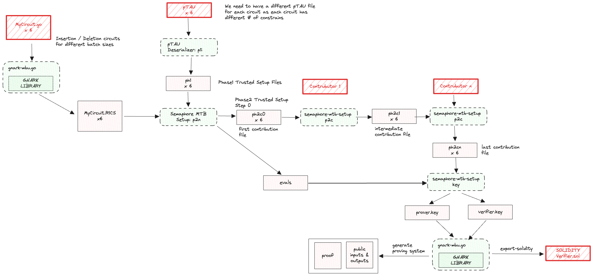

Worldcoin uses two types of circuits: Semaphore to prove the inclusion of a WorldId in the anonymity set, and the Semaphore Merkle Tree Batcher (SMTB) to efficiently insert or delete users from the Semaphore Merkle trees.

## SMTB

SMTB is a service for batch processing of Merkle tree updates. It is designed to be used in conjunction with Semaphore. It accepts Merkle tree updates and batches them together into a single one. This is useful for reducing the number of transactions that need to be submitted to the blockchain. The correctness of the batched Merkle tree update is assured through the generation of a SNARK (generated through gnark).

### Verification process

Three repos need to be downloaded for the generation of the SMTB onchain verifiers:

- [semaphore-mtb](https://github.com/worldcoin/semaphore-mtb) at commit `113f8a8a4d2aecf42b9173fd0a52bef5120fcaec`;
- [semaphore-mtb-setup](https://github.com/worldcoin/semaphore-mtb-setup) at commit `d46ef6be3eb0c43303d7e817f7d0c005530addf0`;
- [ptau-deserializer](https://github.com/worldcoin/ptau-deserializer) at commit `922115452ffdb4b92972e3b81277e5931fb90efa`.
- [gnark-contract-generator](https://github.com/worldcoin/gnark-contract-generator.git) at commit `1eb487a151323cbc41ac4a6b7b24f71268d61be2`.

Each repo must be built using the `go build .` command.



The first step consists in generating the r1cs file from the circuit source codes, which are written in Go and can be found [here](https://github.com/worldcoin/semaphore-mtb/tree/master/prover). To do so, run the following command inside the `semaphore-mtb` directory:

`./gnark-mbu r1cs --mode {insertion/deletion} --batch-size <BATCH_SIZE> --tree-depth 30 --output <MODE>_b<BATCH_SIZE>t30.r1cs`

The second step is to convert the appropriate PPTAU ceremony file (directory [here](https://github.com/iden3/snarkjs#7-prepare-phase-2)) into a .ph1 file, which is used in the "first phase" of the trusted setup, which is universal. The appropriate PPTAU file depend on the number of constraints in the r1cs file:

- `insertion_b10t30.r1cs` (2^20 >= 735819 constraints)
- `insertion_b100t30.r1cs` (2^23 >= 6393519 constraints)
- `insertion_b600t30.r1cs` (2^26 >= 36822519 constraints)
- `insertion_b1200t30.r1cs` (2^27 >= 73452519 constraints)
- `deletion_b10t30.r1cs` (2^19 >= 338170 constraints)
- `deletion_b100t30.r1cs` (2^22 >= 2230754 constraints)

So, for example, for the `deletion_b10t30.r1cs` file, the command to run inside the `ptau-deserializer` directory is:

`go run main.go convert --input powersOfTau28_hez_final_19.ptau --output 19.ph1`

Now we need to initialize the phase 2 of the trusted setup, which is circuit specific. This is the step that takes the longest time to complete. To do this, move the r1cs and ph1 files to the `semaphore-mtb-setup` directory and run the following command:

`./semaphore-mtb-setup p2n <DEPTH>.ph1 <MODE>_b<BATCH_SIZE>t30.r1cs <MODE>_b<BATCH_SIZE>t30c0.ph2`

where `c0` means that we have started phase 2 but with 0 contributions. This step also generates the `evals` and `srs.lag` files. The last cumulative contribution files can be downloaded by running the following commands:

```bash
curl --output deletion_b10t30c16.ph2 https://semaphore-mtb-trusted-setup-ceremony.s3.amazonaws.com/deletion_b10/deletion_b10t30c16.ph2
curl --output deletion_b100t30c16.ph2 https://semaphore-mtb-trusted-setup-ceremony.s3.amazonaws.com/deletion_b100/deletion_b100t30c16.ph2
curl --output insertion_b10t30c16.ph2  https://semaphore-mtb-trusted-setup-ceremony.s3.amazonaws.com/insertion_b10/insertion_b10t30c16.ph2
curl --output insertion_b100t30c16.ph2 https://semaphore-mtb-trusted-setup-ceremony.s3.amazonaws.com/insertion_b100/insertion_b100t30c16.ph2
curl --output insertion_b600t30c16.ph2 https://semaphore-mtb-trusted-setup-ceremony.s3.amazonaws.com/insertion_b600/insertion_b600t30c16.ph2
curl --output insertion_b1200t30c16.ph2_parts_aa https://semaphore-mtb-trusted-setup-ceremony.s3.amazonaws.com/insertion_b1200/insertion_b1200t30c16.ph2_parts_aa
curl --output insertion_b1200t30c16.ph2_parts_ab https://semaphore-mtb-trusted-setup-ceremony.s3.amazonaws.com/insertion_b1200/insertion_b1200t30c16.ph2_parts_ab
cat insertion_b1200t30c16.ph2_parts_aa insertion_b1200t30c16.ph2_parts_ab > insertion_b1200t30c16.ph2
rm insertion_b1200t30c16.ph2_parts_aa insertion_b1200t30c16.ph2_parts_ab
```

Finally, we can check the last contribution against the zeroeth contribution by running the following command inside the `semaphore-mtb-setup` directory:

`./semaphore-mtb-setup p2v <last_contribution_file.ph2> <zeroeth_contribution_file.ph2>`

Now we can generate the verification and prover keys by running the following command inside the `semaphore-mtb-setup` directory:

`./semaphore-mtb-setup key <last_contribution_file.ph2>`

which generates the `vk` and `pk` files.

To generate the smart contract verifier from the verification key, run the following command inside the `gnark-contract-generator` repo with the appropriate `vk` file:

`./gnark-contract-generator ps-vk --vk vk --out deletion_b10t30_verifier.sol`

The so-generated verifier must be checked against the onchain verifier listed above.
